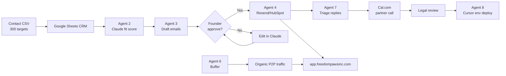

# Freedom Paws — AI & AI Agent Outreach Automation Playbook

**Date:** June 13, 2026  
**Purpose:** Tool list, agent roles, and **click-by-click** setup to automate partner/affiliate outreach from the 300-target directory — with human approval gates  
**Inputs:** [Partner Contact Directory CSV](./Freedom-Paws-Partner-Contact-Directory-June-13-2026.csv) · [Acquisition Roadmap](./Freedom-Paws-Partner-Affiliate-Acquisition-Roadmap-and-Directory-June-13-2026.md) · [Marketing Plan](./Freedom-Paws-Partner-Acquisition-Marketing-Plan-June-13-2026.md)  
**Outbound mailboxes:** partners@freedompawsinc.com · shelter@freedompawsinc.com

---

## Table of contents

1. [What AI can and cannot automate (2026)](#1-what-ai-can-and-cannot-automate-2026)
2. [Recommended AI agent stack for Freedom Paws](#2-recommended-ai-agent-stack-for-freedom-paws)
3. [Eight agent roles — definitions & execution](#3-eight-agent-roles--definitions--execution)
4. [Master workflow architecture](#4-master-workflow-architecture)
5. [Click-by-click: Stack A — CRM + AI drafts (start here)](#5-click-by-click-stack-a--crm--ai-drafts-start-here)
6. [Click-by-click: Stack B — n8n automation hub](#6-click-by-click-stack-b--n8n-automation-hub)
7. [Click-by-click: Stack C — Resend email sequences](#7-click-by-click-stack-c--resend-email-sequences)
8. [Click-by-click: Stack D — Clay enrichment + personalized B2B](#8-click-by-click-stack-d--clay-enrichment--personalized-b2b)
9. [Click-by-click: Stack E — Lindy / Relevance AI agents](#9-click-by-click-stack-e--lindy--relevance-ai-agents)
10. [Click-by-click: Stack F — Social content automation](#10-click-by-click-stack-f--social-content-automation)
11. [Click-by-click: Stack G — Affiliate network applications](#11-click-by-click-stack-g--affiliate-network-applications)
12. [Click-by-click: Stack H — SMS (opt-in only)](#12-click-by-click-stack-h--sms-opt-in-only)
13. [Click-by-click: Stack I — Cursor engineering agent (partner go-live)](#13-click-by-click-stack-i--cursor-engineering-agent-partner-go-live)
14. [Prompt library (copy-paste)](#14-prompt-library-copy-paste)
15. [Compliance guardrails](#15-compliance-guardrails)
16. [Cost summary](#16-cost-summary)
17. [30-day rollout calendar](#17-30-day-rollout-calendar)

---

## 1. What AI can and cannot automate (2026)

| Task | Automate? | Human required? | Best tool class |
|------|-----------|-----------------|-----------------|
| Import 300 targets from CSV | ✅ Full | No | n8n / Google Sheets |
| Research org mission fit | ✅ 80% | Review top 20% | Claude / ChatGPT + Clay |
| Draft personalized email | ✅ 90% | Approve before send | Claude Project + HubSpot |
| Send cold B2B email at scale | ⚠️ Partial | **Approve each batch** | Resend / Instantly |
| Submit affiliate applications | ⚠️ Partial | **You click submit** | Browser + AI form fill assist |
| LinkedIn connection requests | ⚠️ Partial | Manual caps (20/day) | LinkedIn + AI draft |
| Instagram DM at scale | ❌ Avoid bots | Manual / authentic | Buffer for posts only |
| SMS to purchased lists | ❌ Illegal/non-compliant | Opt-in only | Twilio + n8n |
| Shelter LOI negotiation | ❌ Low | Founder calls | AI prep brief only |
| Veteran MOU / mission partnerships | ❌ Low | Founder trust | AI deck draft |
| Partner URL → Vercel env deploy | ✅ 70% | Approve env values | Cursor agent + script |
| Social Reels captions + schedule | ✅ 85% | Approve calendar | ChatGPT + Buffer |
| Follow-up scheduling | ✅ Full | No | HubSpot / n8n |
| FTC disclosure check | ✅ Assist | Legal final | Claude compliance prompt |

**Golden rule:** **Human-in-the-loop (HITL)** for every *first contact* and every *contract/env change*. AI prepares; founder approves.

---

## 2. Recommended AI agent stack for Freedom Paws

### Tier 1 — Start this week (low cost, high control)

| Tool | Role | Monthly cost |
|------|------|-------------:|
| **Google Sheets** | Master CRM from CSV | $0 |
| **Claude Pro** or **ChatGPT Plus** | Draft agent / research | **$20** |
| **Notion** (optional) | Pipeline + task DB | $0–$10 |
| **Resend** (existing) | Transactional + outreach send | **$0–$20** |
| **Cursor** (existing) | Engineering agent for app/env | Existing |
| **Cal.com** | Book 15-min partner calls | $0 |

### Tier 2 — Month 2 (workflow automation)

| Tool | Role | Monthly cost |
|------|------|-------------:|
| **n8n** (self-host or cloud) | Connect Sheets → AI → Resend → Slack | **$0–$24** |
| **HubSpot Free CRM** | Deal stages, email tracking | $0 |
| **Buffer** | IG/FB/TikTok schedule | $0–$6 |
| **Make.com** (alt. to n8n) | Visual automations | **$0–$16** |

### Tier 3 — Scale (Q1 2027, after PMF)

| Tool | Role | Monthly cost |
|------|------|-------------:|
| **Clay.com** | Enrich contacts, AI personalization | **$149+** |
| **Instantly.ai** or **Lemlist** | Multi-inbox sequences (careful volume) | **$30–$97** |
| **Lindy.ai** or **Relevance AI** | No-code AI agents | **$50–$200** |
| **Apollo.io** | B2B email finder (verify public only) | **$49+** |
| **LinkedIn Sales Navigator** | BD targeting | **$80** |

### Models (LLM) — when to use which

| Model / product | Best for |
|-----------------|----------|
| **Claude Sonnet** (claude.ai) | Long outreach drafts, policy-aware tone, shelter/veteran copy |
| **GPT-4o** (ChatGPT) | Spreadsheet formulas, social captions, quick variants |
| **Cursor Agent** | Code: env vars, wellness pages, affiliate link integration |
| **n8n AI nodes** | Classify replies, summarize call notes |
| **Resend** (no LLM) | Reliable deliverability for approved emails |

---

## 3. Eight agent roles — definitions & execution

### Agent 1 — **Directory Import Agent**

**Job:** Keep CRM synced with `Freedom-Paws-Partner-Contact-Directory-June-13-2026.csv`.

**Execution:**
1. CSV → Google Sheets (one tab per category).
2. Columns add: `Status`, `Last_Contact`, `Next_Followup`, `Owner`, `AI_Draft_Link`.
3. n8n weekly: if CSV in repo updates → refresh Sheet (manual export OK week 1).

**Automate:** 95% · **Human:** column mapping once.

---

### Agent 2 — **Research & Fit Scoring Agent**

**Job:** Score each target 1–5 for mission fit before outreach.

**Execution (manual + AI):**
1. Paste org row + website into Claude with [Partner Policies](./Freedom-Paws-Wellness-Partner-Policies-June-2026.md) excerpt.
2. Prompt: “Score wellness-first fit 1–5; flag pharma-first risk; suggest one personalization hook.”
3. Write score to Sheet column `Fit_Score`.

**Automate:** 80% · **Human:** approve score ≥4 for active outreach.

---

### Agent 3 — **Personalization Draft Agent**

**Job:** Generate 3-touch email sequence per target.

**Execution:**
- Input: Org name, category, partnership URL, Fit_Score, Freedom Paws funnel link.
- Output: Email 1 intro, Email 2 value, Email 3 close — saved to Notion or Sheet cell.
- **Never auto-send.**

**Automate:** 90% draft · **Human:** edit + approve 100%.

---

### Agent 4 — **Outreach Sequence Agent**

**Job:** Schedule approved emails Day 0, 7, 21.

**Execution:** HubSpot sequences OR n8n + Resend with `scheduledAt` after founder sets `Approved=YES`.

**Automate:** 70% · **Human:** approval gate.

---

### Agent 5 — **Affiliate Application Prep Agent**

**Job:** Pre-fill application answers; founder submits.

**Execution:** Claude reads affiliate form questions → drafts answers in Google Doc → founder copy-paste into Impact/Pets Best forms.

**Automate:** 60% prep · **Human:** submit + KYC.

---

### Agent 6 — **Social Content Agent**

**Job:** Weekly ViT + wellness + shelter/veteran posts.

**Execution:** ChatGPT batch 7 captions → Buffer queue → founder approves calendar Sunday.

**Automate:** 85% · **Human:** approve posts, no auto-DM.

---

### Agent 7 — **Reply Triage Agent**

**Job:** Classify inbound replies (interested / not now / wrong contact / legal).

**Execution:** n8n: Resend inbound webhook → Claude classify → Slack notify founder → update CRM status.

**Automate:** 75% · **Human:** all negotiations.

---

### Agent 8 — **Partner Go-Live Agent (Cursor)**

**Job:** When partner URLs approved, update `.env.local`, run `vercel:env:push`, verify config-status.

**Execution:** See [Stack I](#13-click-by-click-stack-i--cursor-engineering-agent-partner-go-live).

**Automate:** 70% · **Human:** approve secrets + deploy.

---

## 4. Master workflow architecture



---

## 5. Click-by-click: Stack A — CRM + AI drafts (start here)

**Time:** ~2 hours · **Cost:** $0–$20/mo

### Step 1 — Import directory to Google Sheets

1. Open [Google Sheets](https://sheets.google.com) → **Blank spreadsheet**.
2. Name: `Freedom Paws Partner CRM`.
3. **File → Import → Upload** → select `docs/Freedom-Paws-Partner-Contact-Directory-June-13-2026.csv`.
4. Import location: **Replace current sheet**.
5. Add columns (right side): `Fit_Score`, `Status`, `Approved`, `Email1_Sent`, `Notes`.
6. **Data → Create a filter view** → filter `Priority` contains `★★★`.

### Step 2 — Create Claude Project (knowledge base)

1. Go to [claude.ai](https://claude.ai) → **Projects** → **New project**.
2. Name: `Freedom Paws Partner Outreach`.
3. **Add knowledge:** upload these files from repo:
   - `Freedom-Paws-Wellness-Partner-Policies-June-2026.md`
   - `Freedom-Paws-Partner-Acquisition-Marketing-Plan-June-13-2026.md`
   - First 50 rows of CSV (export Insurance tab only) OR paste policy summary.
4. **Custom instructions** (paste):

```
You draft B2B partnership emails for Freedom Paws Wellness — holistic, prevention-first, never pharmaceutical-first. Always mention member savings requirement. Include link to app.freedompawsinc.com/wellness/partners. Tone: professional, warm, mission-driven. Never claim we are a vet clinic or insurer. Output: 3 emails (Day 0, 7, 21) under 180 words each.
```

### Step 3 — Generate first 10 drafts

1. In project chat, paste:

```
Target: Embrace Pet Insurance
Category: Pet insurance B2B affiliate
Apply URL: Impact Embrace program
Public email: press@embracepetinsurance.com
Hook: ViT urgent + ID lost-dog funnel, only 3-4% pets insured
```

2. Copy output → Sheet row **Notes** column.
3. Repeat for ranks 1–10 Insurance tab.
4. Set `Status` = `Drafted`.

### Step 4 — HubSpot Free CRM (optional tracking)

1. Go to [hubspot.com](https://www.hubspot.com) → **Get free CRM**.
2. **Contacts → Import** → upload CSV (map Organization → Company name).
3. Create **Deal pipeline:** `Partner Outreach` stages: `Research → Drafted → Approved → Sent → Meeting → Signed → Live`.
4. Manual: link each company to deal when email sent.

### Step 5 — Cal.com for partner calls

1. [cal.com](https://cal.com) → sign up → **Event type:** `15 min Partner Intro`.
2. Description: link to `/wellness/partners`.
3. Paste booking link in Email 1 signature.

---

## 6. Click-by-click: Stack B — n8n automation hub

**Time:** ~3 hours · **Cost:** $0 self-hosted or ~$24/mo cloud

### Step 1 — Create n8n account

1. Option A (cloud): [n8n.io](https://n8n.io) → **Start free trial**.
2. Option B (local): `npm install n8n -g` → `n8n start` → open `http://localhost:5678`.

### Step 2 — Workflow: “New row → Slack reminder”

1. **New workflow** → add **Google Sheets Trigger** (poll every hour).
   - Connect Google OAuth.
   - Spreadsheet: `Freedom Paws Partner CRM`.
   - Trigger: **Row added or updated** where `Approved` = `YES` and `Email1_Sent` is empty.
2. Add **Slack** node (or email): message founder “Ready to send: {Organization}”.
3. **Save** → **Activate**.

### Step 3 — Workflow: “Mark sent → schedule follow-up”

1. Trigger: manual webhook OR Google Sheets when `Email1_Sent` = `DATE`.
2. **Wait** node: 7 days.
3. Slack: “Send Email 2 for {Organization}”.
4. **Wait** 14 more days → “Send Email 3”.

### Step 4 — AI node (optional)

1. Add **OpenAI** or **Anthropic** node after Sheet read.
2. Pass row JSON → return `Fit_Score` + one-liner hook.
3. Write back to Sheet.

**Note:** Do not connect auto-send to Resend without approval webhook.

---

## 7. Click-by-click: Stack C — Resend email sequences

**Uses existing** `notifications@freedompawsinc.com`

### Step 1 — Create outreach audience tag

1. [Resend Dashboard](https://resend.com) → **Audiences** (or use Broadcasts).
2. Create audience: `partner-prospects-b2b`.
3. **Do not import purchased lists** — manual add only after public email confirmed.

### Step 2 — Send approved one-off (safest start)

1. Resend → **Emails → Send**.
2. **From:** `Freedom Paws Partners <notifications@freedompawsinc.com>`.
3. **Reply-to:** `partners@freedompawsinc.com`.
4. Paste Claude-approved Email 1.
5. Include footer: physical address + unsubscribe (CAN-SPAM).
6. **Send** to single verified address (e.g. press@embracepetinsurance.com).
7. Update Sheet: `Email1_Sent` = today, `Status` = `Sent`.

### Step 3 — Broadcast batch (max 30/week)

1. Resend → **Broadcasts → Create**.
2. Audience: manually vetted contacts only.
3. Subject A/B: test 2 subjects on 10 contacts each.
4. Track opens → Sheet.

### Step 4 — Inbound reply forwarding

1. Resend → **Domains** → verify `freedompawsinc.com` (done).
2. ✅ `partners@` / `shelter@` / `info@` live on Namecheap Private Email (iPhone + Mac Mail IMAP) — July 12, 2026.
3. Optional n8n: parse reply → Claude triage (Agent 7).

---

## 8. Click-by-click: Stack D — Clay enrichment + personalized B2B

**When:** 50+ active outreach targets · **Cost:** ~$149/mo

1. Go to [clay.com](https://www.clay.com) → **Sign up** → **New table**.
2. **Import CSV** → Partner directory.
3. Add enrichment column: **Find company LinkedIn**.
4. Add **AI column** (Claygent): prompt:

```
Write one sentence why {Organization} fits Freedom Paws holistic wellness + pet ID mission. Avoid generic fluff.
```

5. Add **Email column**: use only if Clay returns **verified business email** from public sources.
6. Export enriched rows → HubSpot.
7. **Human:** verify each email before send.

---

## 9. Click-by-click: Stack E — Lindy / Relevance AI agents

**For:** reply triage, meeting prep, weekly research digest

### Option A — Lindy.ai

1. [lindy.ai](https://www.lindy.ai) → **Sign up**.
2. **New Lindy** → template **“Email Assistant”** or blank.
3. Trigger: **Email received** at `partners@freedompawsinc.com` (connect Gmail).
4. Action: **Classify** → labels `Partner-Hot`, `Partner-Cold`, `Spam`.
5. Action: **Draft reply** using knowledge doc upload (Partner Policies PDF).
6. **Setting:** “Require approval before sending” → **ON**.

### Option B — Relevance AI

1. [relevanceai.com](https://relevanceai.com) → **Agents** → **Build agent**.
2. Name: `Freedom Paws Partner Researcher`.
3. Tools: web search + file knowledge.
4. Schedule: **Weekly Monday 8am** → “Summarize top 10 ★★★ targets not yet contacted from CRM export.”
5. Output: email to founder.

---

## 10. Click-by-click: Stack F — Social content automation

**P2P acquisition — posts only, not DMs**

### Step 1 — ChatGPT content batch

1. ChatGPT → new chat → paste:

```
Create 7 Instagram captions for Freedom Paws: 2 ViT diagnostics, 2 Freedom Paws ID, 1 wellness insurance education, 1 veteran dog, 1 shelter adoption. Include CTA to app.freedompawsinc.com. Hashtags max 5. Wellness-first tone.
```

2. Save to Google Doc `Social Week of [date]`.

### Step 2 — Buffer schedule

1. [buffer.com](https://buffer.com) → **Connect Instagram** business account.
2. **Create post** → paste caption → add link in bio reminder (IG no link in post).
3. Schedule: Mon/Wed/Fri 10am local.
4. **Queue** 7 posts.

### Step 3 — Canva + AI (optional)

1. [canva.com](https://www.canva.com) → **Magic Design** → “Freedom Paws ViT dog wellness Instagram post”.
2. Export → attach to Buffer.

**Do not use:** Instagram auto-DM bots (ToS risk).

---

## 11. Click-by-click: Stack G — Affiliate network applications

**Semi-automated — human submits**

### Impact.com (Embrace, many insurers)

1. Go to [impact.com](https://impact.com) → **Sign up** → **Publisher**.
2. Complete tax profile (W-9).
3. **Discover brands** → search `Embrace Pet Insurance`.
4. **Apply** → answer questions using **Agent 5** Claude draft:

```
Prompt Claude: "Answer affiliate application for Freedom Paws — PWA app at app.freedompawsinc.com, 10 holistic protocols, ViT AI, Freedom Paws ID lost-dog pilot, audience US dog owners, wellness-first not pharmaceutical."
```

5. Copy answers → paste → **Submit**.
6. Sheet: `Status` = `Applied`.

### Pets Best direct form

1. Open [petsbest.com/forms/affiliates](https://www.petsbest.com/forms/affiliates).
2. Claude draft for “Message” field emphasizing API + app integration interest.
3. Submit → call 888-217-2731 if no response in 10 days.

### ShareASale / Awin (Honest Kitchen, Open Farm)

1. [shareasale.com](https://www.shareasale.com) → publisher signup.
2. Search merchant → **Join program**.
3. Repeat for [awin.com](https://www.awin.com).

---

## 12. Click-by-click: Stack H — SMS (opt-in only)

**Defer until founding member list has double opt-in**

1. [twilio.com](https://www.twilio.com) → sign up → **Phone number** (local US).
2. **Messaging → Regulatory Compliance → 10DLC** → register brand “Freedom Paws Wellness”.
3. Campaign use case: **Customer care** / **Account notifications** only.
4. n8n workflow: only fire if Sheet column `SMS_Opt_In` = `YES` and timestamp recorded.
5. Message template:

```
Freedom Paws: Your founding member wellness tip + ViT link: app.freedompawsinc.com/diagnostics Reply STOP to opt out.
```

6. **Never** SMS shelter/veteran contacts without written consent at event.

**Cost:** ~$15 setup + ~$0.01/msg.

---

## 13. Click-by-click: Stack I — Cursor engineering agent (partner go-live)

**When partner URLs are signed**

### In Cursor (this repo)

1. Open `.env.local`.
2. Add:

```bash
NEXT_PUBLIC_FP_INSURANCE_ENABLED=true
NEXT_PUBLIC_FP_INSURANCE_PARTNER_NAME=Embrace Pet Insurance
NEXT_PUBLIC_FP_INSURANCE_QUOTE_URL=https://...
NEXT_PUBLIC_FP_INSURANCE_LOST_DOG_URL=https://...
NEXT_PUBLIC_FP_INSURANCE_URGENT_URL=https://...
```

3. Chat → Agent mode:

```
Add insurance partner env vars from my message, run npm run vercel:env:push, verify /api/wellness/config-status locally, do not run vercel env pull.
```

4. Founder approves → agent runs push + `npx vercel --prod --yes`.
5. Verify: `curl https://app.freedompawsinc.com/api/wellness/config-status`.

---

## 14. Prompt library (copy-paste)

### Fit scoring

```
Organization: {name}
Category: {category}
Website: {url}
Policies excerpt: wellness-first, no pharma-first co-marketing, member discount required.

Return JSON: { "fit_score": 1-5, "risk_flags": [], "personalization_hook": "one sentence", "recommended_channel": "email|linkedin|phone|apply_form" }
```

### 3-touch B2B email

```
Write 3 emails for Freedom Paws partnering with {name} ({category}).
Email 1 Day 0: intro + mission + link app.freedompawsinc.com/wellness/partners/insurance OR /telehealth
Email 2 Day 7: member value + ViT/ID funnel data (illustrative)
Email 3 Day 21: polite close + Cal.com link placeholder
Max 180 words each. Include FTC affiliate disclosure note if insurance.
```

### Shelter LOI prep

```
Draft 1-page LOI email for {shelter name} in {state} for Freedom Paws ID biometric pilot: free intake, found-dog match, human review before owner contact, 50 free enrollments at adoption event. Link /id/shelter and E2E runbook summary.
```

### Reply triage

```
Classify this email reply: INTERESTED / NOT_NOW / WRONG_CONTACT / LEGAL_QUESTION / SPAM
Suggest 2-sentence founder response.
Reply text: {paste}
```

### Social caption

```
Write 1 Instagram Reel caption: Freedom Paws ViT free scan → holistic protocol recommendation. CTA diagnostics. 5 hashtags. 120 words max. Wellness not veterinary treatment.
```

---

## 15. Compliance guardrails

| Rule | Implementation |
|------|----------------|
| CAN-SPAM | Physical address in footer; unsubscribe link; honest subject lines |
| TCPA | SMS only with documented opt-in; 10DLC registered |
| FTC affiliate | Disclosure on all insurance/affiliate pages (already in app) |
| LinkedIn | ≤20 connection requests/day; no scraped lists |
| Instagram | No automated DMs; organic comments only |
| GDPR/CCPA | B2B only US focus; delete on request |
| AI hallucination | Never auto-send without human read |
| Secrets | Never put API keys in Claude/ChatGPT; use env + Cursor only |

**Automation kill switch:** If bounce rate >5% or spam complaint → pause Agent 4 immediately.

---

## 16. Cost summary

| Phase | Tools | Monthly |
|-------|-------|--------:|
| **Week 1** | Sheets + Claude + Resend + Cal.com | **~$20** |
| **Month 2** | + n8n + Buffer + HubSpot | **~$45** |
| **Scale** | + Clay + Instantly + Lindy + Sales Nav | **~$350–$500** |

**Founder time saved (est.):** 15–25 hrs/week at Month 2 if HITL discipline maintained.

---

## 17. 30-day rollout calendar

| Week | Setup | Agent active |
|------|-------|--------------|
| **1** | Stack A (Sheets + Claude + 10 drafts) | Research + Draft |
| **2** | Resend manual sends + Cal.com | Sequence (manual) |
| **3** | n8n reminders + reply triage | Follow-up |
| **4** | Buffer social + 5 affiliate applies | Social + Affiliate prep |
| **5–8** | HubSpot pipeline + optional Clay | Scale B2B |
| **9+** | Lindy reply agent + Cursor go-live | Partner live automation |

---

## Quick start today (60 minutes)

1. ☐ Import CSV → Google Sheets (10 min)  
2. ☐ Create Claude Project + upload Partner Policies (15 min)  
3. ☐ Draft Embrace + Pets Best + Spot emails (20 min)  
4. ☐ Send **one** approved email via Resend (10 min)  
5. ☐ Log in Sheet; schedule Day 7 follow-up in calendar (5 min)  

---

## Document control

| Item | Detail |
|------|--------|
| **Date** | June 13, 2026 |
| **Related CSV** | 300 targets — filter ★★★ first |
| **Engineering** | Cursor Agent for env/deploy only |
| **Legal** | Counsel before scaled email/SMS |

---

*Freedom Paws Wellness — Honor Buddy's Legacy*
