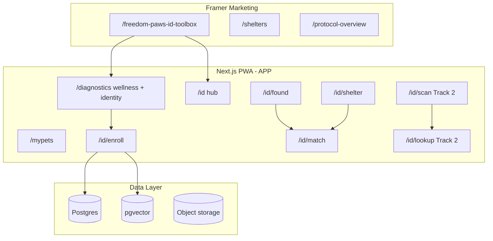

# Freedom Paws ID — Complete Master Roadmap

**Version 1.0 (Master) | June 10, 2026**  
**Status:** Authoritative single document — all ID, ViT identity, microchip, GTM, costs, timelines  
**Supersedes for detail:** `Freedom-Paws-ID-Lost-Dog-Infrastructure-Roadmap.md` v2.0 (summary); use **this file** for full review  
**Related:** `Freedom-Paws-ID-Founder-Review-June-2026.md` (decision checklist) · `Freedom-Paws-Launch-Todo-Prioritized-June-2026.md` · `ViT-Diagnostics-Vision-and-Roadmap.md` · `Framer-CTA-Link-Map.md` Section 14

`{APP}` = `https://app.freedompawsinc.com`  
`{FRAMER}` = `https://freedompawsinc.com`

---

## Table of contents

1. [Executive summary & build order](#1-executive-summary--build-order)
2. [Strategic rationale](#2-strategic-rationale)
3. [Current codebase inventory (what exists today)](#3-current-codebase-inventory)
4. [ViT vision platform — eyes, face, body, posture, gait](#4-vit-vision-platform)
5. [Track 1 — Biometric (unchipped) module — full spec](#5-track-1--biometric-module)
6. [Track 2 — Chipped module — full research & spec](#6-track-2--chipped-module)
7. [Data architecture & APIs](#7-data-architecture--apis)
8. [Security, privacy, legal](#8-security-privacy-legal)
9. [29-week phase plan (every task)](#9-29-week-phase-plan)
10. [Week-by-week calendar with dates](#10-week-by-week-calendar)
11. [Framer marketing page — copy, links, tests](#11-framer-marketing-page)
12. [Go-to-market — shelters, vets, owners](#12-go-to-market)
13. [Social media & promotion plan](#13-social-media--promotion-plan)
14. [Cost estimates (every line item)](#14-cost-estimates)
15. [Adoption & revenue projections](#15-adoption--revenue-projections)
16. [Risk register](#16-risk-register)
17. [Success criteria & launch gates](#17-success-criteria--launch-gates)
18. [Founder decisions required](#18-founder-decisions-required)
19. [Post-launch roadmap (2027+)](#19-post-launch-roadmap)
20. [Document index & changelog](#20-document-index--changelog)

---

## 1. Executive summary & build order

Freedom Paws ID & Tool Box is the **B2B growth engine** for shelters and veterinarians. Launch is **flexible**; **promotion mode begins only after infrastructure is complete.**

### Build order (founder-locked v2.0)

| Track | Order | Scope | Target |
|-------|-------|-------|--------|
| **Track 1** | **First** | ViT identity regions + biometric enroll + found-dog match + shelter portal | **Oct 1, 2026** pilot |
| **Track 2** | **Second** | Universal chip scanner + AAHA/AVID registry + chip on profile + kit retail | **Jan 15, 2027** |
| **Promotion** | **After both** | National marketing, no “coming soon” on live features | **Jan 1, 2027** (founder — moved up) |

### Milestone table

| # | Milestone | Date | Week |
|---|-----------|------|------|
| M0 | Build starts | Jun 10, 2026 | 0 |
| M1 | Framer ID page published + wired | Jun 24, 2026 | 2 |
| M2 | Server My Pets + `/id` hub live | Jul 15, 2026 | 5 |
| M3 | ViT multi-region + gait beta | Aug 15, 2026 | 9 |
| M4 | Biometric enroll wizard live | Sep 2, 2026 | 12 |
| M5 | **Biometric shelter pilot E2E** | **Oct 1, 2026** | **16** |
| M6 | 15 shelter partners (biometric) | Dec 31, 2026 | 21 |
| M7 | Track 2 chip scan + parser | Nov 15, 2026 | 23 |
| M8 | AAHA + AVID registry UX | Dec 15, 2026 | 25 |
| M9 | Chipped module complete | Dec 15, 2026 | 25 |
| M10 | **Full launch → promotion mode** | **Jan 1, 2027** | **27** |
| M10b | **Impact Dashboard** live public KPIs | **First confirmed reunion** **or** **Jan 2027 promo prep** (earliest; not before L5) | — |

### Architecture diagram



---

## 2. Strategic rationale

### Why biometric (unchipped) first

| Factor | Detail |
|--------|--------|
| **Shelter reality** | Est. 40–60% of intakes unchipped, chip unreadable, or unregistered |
| **Technical leverage** | ViT Diagnostics already live — extend same pipeline to identity |
| **Marketing** | “Same Vision Transformer — wellness today, reunion tomorrow” |
| **No hardware dependency** | Phone camera sufficient for Track 1 pilot |
| **Faster proof** | Reunion story for grants/press without waiting for scanner OEM |

### Why chipped second

| Factor | Detail |
|--------|--------|
| **Requires hardware** | LF RFID 125/128/134.2 kHz — phones cannot read implants |
| **Registry fragmentation** | AAHA routing + AVID non-participant branch — partnership lead time |
| **Additive value** | Chip links **onto** biometric profile — not a separate product |

### Product promise (honest at each gate)

| Date | May claim | May NOT claim |
|------|-----------|---------------|
| Now–Sep 2026 | ViT diagnostics live; ID vision in development | Lost-dog match live; phone reads microchips |
| Oct 2026–Jan 2027 | Biometric enroll + shelter found-dog match (pilot) | All chips readable without scanner kit |
| Feb 2027+ | Full ID: biometric + universal scanner + registry routing | Government license; veterinary diagnosis |

---

## 3. Current codebase inventory

### Live today (`{APP}`)

| Route / module | File(s) | Capability | ID relevance |
|----------------|---------|------------|--------------|
| `/diagnostics?mode=identity` | `ViTIdentityResultsPanel.tsx` | ViT identity regions + enroll CTA | **Live** |
| `/id` hub | `app/id/page.tsx` | Track 1 + Track 2 preview cards | **Live** |
| `/id/enroll` | `EnrollWizardClient.tsx`, enroll APIs | 9-step biometric wizard | **Live** |
| `/id/found`, `/id/match` | `found-server.ts`, `match-server.ts` | Intake + human review queue | **Live** |
| `/id/shelter` | `ShelterDashboardClient.tsx` | Stats + intake/review links | **Live** |
| `/id/settings` | `IdSettingsClient.tsx` | Alerts + revoke enrollment | **Live** |
| `/id/p/[slug]` | `public-card.ts` | Public QR reunion card | **Live** |
| `/login` | Supabase magic link | Owner + shelter auth | **Live** |
| `/api/pets` | `app/api/pets/*` | Server-backed My Pets when signed in | **Live** |
| `/api/analyze` | `identity-analyze.ts` | `mode=identity` vision | **Live** |
| `lib/id/embeddings.ts` | pgvector RPC | Similarity search (0.72 default) | **Live** |
| Audit log | `004_audit_settings.sql`, `audit.ts` | Match/found/revoke events | **Live** |
| `/diagnostics` wellness | `app/diagnostics/*` | Photo + video ViT → protocols | Existing |
| `/mypets` | `MyPetsClient.tsx` | localStorage + cloud sync | Existing |
| `/token-shop`, `/protocols` | — | Revenue; cross-sell | Existing |

### Track 2 — preview only (stubs live, hardware/API not built)

| Route | Status |
|-------|--------|
| `/id/scan`, `/id/lookup`, `/id/kit` | Placeholder pages + hub links |
| `/id/vet` | Not started |
| Bluetooth scanner + AAHA API | Week 18+ |

### Framer (marketing)

| Page | Status |
|------|--------|
| `/freedom-paws-id-toolbox` | In progress — CTAs, toolbox hotspots, bottom buttons |
| `/protocol-overview` | Live |
| `/shelters` | Footer link exists in app |

---

## 4. ViT vision platform

### 4.1 Region specification (complete)

| Region | Capture instructions | Min resolution | Quality gate failures | Wellness output | Identity output |
|--------|------------------------|----------------|----------------------|-----------------|-----------------|
| **Eyes** | Close-up both eyes, no flash glare | 800×600 | Blur, closed eyes only, extreme glare | Discharge, cloudiness, squint → `clear-vision` | `periocularPattern`, `eyeGeometry` |
| **Face** | Front-facing, ears visible, neutral | 1024×768 | Profile-only, cropped, heavy filter | Stress markers, breed cues | `facialGeometry`, `markingsFace` |
| **Body** | Left + right side, full body in frame | 1024×768 | Partial body, leash obscuring >40% | BCS, coat, hotspots | `coatPattern`, `bodyMarkings`, `buildClass` |
| **Posture** | Standing still, side view | 1024×768 | Sitting only (warn) | Stance asymmetry → `max-movement` | `postureClass`, `spineAngle` |
| **Gait** | 3–5 s walk toward or past camera | 720p video | Dog stationary, <2 s | Limp, stiffness | `gaitDescriptor`, `limbSymmetry`, `strideNotes` |

### 4.2 API modes

`POST /api/analyze`

| Field | Type | Values |
|-------|------|--------|
| `mode` | string | `wellness` (default) \| `identity` \| `both` |
| `regions` | string[] | `eyes`, `face`, `body`, `posture`, `gait` |
| `frames` | File[] | Photos; gait uses extracted video frames |
| `symptoms` | string | Optional; used in wellness mode |
| `petId` | string | Optional; link result to enroll draft |

**Response extensions (`identity`):**

```json
{
  "identity": {
    "regions": {
      "eyes": { "descriptors": [], "qualityScore": 0.92 },
      "face": { "descriptors": [], "qualityScore": 0.88 },
      "body": { "descriptors": [], "qualityScore": 0.85 },
      "posture": { "postureClass": "neutral", "qualityScore": 0.80 },
      "gait": { "gaitDescriptor": "...", "limbSymmetry": "symmetric", "qualityScore": 0.75 }
    },
    "fusedDescriptorText": "...",
    "enrollReady": true
  }
}
```

### 4.3 Embedding pipeline

| Step | Implementation |
|------|----------------|
| 1 | Vision model returns structured descriptors per region |
| 2 | Concatenate + normalize → `fusedDescriptorText` |
| 3 | `text-embedding-3-large` OR dedicated image embedding API → vector (1536-dim) |
| 4 | Store in `pet_embeddings` with `petId`, `enrollmentId`, `version` |
| 5 | Query: cosine similarity, top-K=5, min threshold 0.72 (tune in pilot) |

### 4.4 File change list (ViT + ID)

| File | Action |
|------|--------|
| `lib/ai/types.ts` | Add `IdentityRegionResult`, `AnalyzeMode` |
| `lib/ai/prompt-templates.ts` | Add `IDENTITY_SYSTEM_PROMPT`, `IDENTITY_ANALYSIS_PROMPT` |
| `lib/ai/vision-analyze.ts` | `analyzeIdentityRegions()` |
| `lib/ai/diagnostics.ts` | Branch on `mode` |
| `app/api/analyze/route.ts` | Parse `mode`, `regions` |
| `lib/vit/media-quality-gate.ts` | `gateEyes()`, `gateFace()`, `gateGait()` |
| `lib/vit/extract-video-frames.ts` | `selectGaitFrames()` mid-stride preference |
| `app/diagnostics/ViTDiagnosticsClient.tsx` | Identity capture UI; “Save to ID profile” |
| `lib/id/embeddings.ts` | **New** — fuse + store + search |
| `lib/id/types.ts` | **New** — full types |
| `app/id/enroll/page.tsx` | **New** — wizard |

### 4.5 Enroll wizard steps (`/id/enroll`)

| Step | UI | Backend |
|------|-----|---------|
| 1 | Select pet (My Pets) or create new | `petId` |
| 2 | Consent modal (biometric) | `consentVersion`, `consentedAt` |
| 3 | Eyes capture | `POST /api/analyze?mode=identity&regions=eyes` |
| 4 | Face capture | same |
| 5 | Body capture (2 angles) | same |
| 6 | Posture still | same |
| 7 | Gait video 3–5 s | extract frames → analyze |
| 8 | Review + confirm | generate embedding, `freedomPawsId`, QR |
| 9 | Success — QR card | `/id/p/[slug]` |

---

## 5. Track 1 — Biometric module

### 5.1 Routes (complete)

| Route | Auth | Roles | Purpose |
|-------|------|-------|---------|
| `/id` | optional | all | Hub: enroll, found, shelter login |
| `/id/enroll` | required | owner | Biometric wizard |
| `/id/p/[slug]` | public | — | QR pet card (owner toggles visibility) |
| `/id/found` | required | shelter_admin, public | Report found dog |
| `/id/match` | required | shelter_admin, fp_ops | Review candidates |
| `/id/shelter` | required | shelter_admin | Dashboard |
| `/id/settings` | required | owner | Alert prefs, revoke consent, delete biometric |

### 5.2 Match policy (complete)

1. **Intake:** Shelter uploads 1+ photos and/or short video of found dog.
2. **Query embedding** generated from intake media.
3. **Search** enrolled DB → top 5 candidates with similarity score.
4. **Display** scores only to `shelter_admin` or `fp_ops` — never to public.
5. **Reviewer** selects 0 or 1 candidate → `approved` \| `rejected` \| `insufficient_evidence`.
6. **Owner notification** only on `approved` — email v1 (Resend); SMS v2 (Twilio).
7. **Owner response** — confirm/reject match; schedule pickup contact.
8. **Audit log** — every view of candidate PII logged.
9. **False match protocol** — apologize, document, retrain threshold; no auto-penalty to reporter.

### 5.3 Roles & permissions

| Role | Permissions |
|------|-------------|
| `owner` | enroll, view own pets, QR card, alert settings, delete biometric |
| `shelter_admin` | found intake, view match candidates for own shelter, approve/reject |
| `shelter_staff` | found intake only (no PII) |
| `vet_staff` | Track 2: scan log, chip verify (Week 24+) |
| `fp_ops` | all match queue, threshold tuning, shelter onboarding |

### 5.4 Shelter pilot package (Track 1)

| Deliverable | Detail |
|-------------|--------|
| Training PDF + 30-min Zoom | Found-dog intake, match review, consent |
| 50 free owner enrollments | Per shelter for adoption events |
| Dedicated support email | shelter@freedompawsinc.com |
| Case study rights | Photo/video for marketing with consent |
| No hardware required | Track 1 only |

---

## 6. Track 2 — Chipped module

### 6.1 Three microchip families (full research)

| Type | Frequency | Encoding | ID format | US prevalence | Scanner requirement |
|------|-----------|----------|-----------|---------------|---------------------|
| **ISO FDX-B** | 134.2 kHz | ISO 11784/11785 | 15 digits (3 country + 12 national) | Majority new implants | ISO universal |
| **FDX-A / FECAVA** | 125 kHz | Non-ISO | 9–10 digits | Legacy US | 125 kHz + **AVID decrypt** |
| **Trovan** | 128 kHz | Proprietary | 10 digits | AKC CAR era, less common | 128 kHz |
| **HDX** | 134.2 kHz | ISO livestock | Variants | Large animals, some readers | HDX-capable reader |

**Critical:** Spec sheet “125/134.2 kHz” is insufficient — must decrypt **AVID encrypted** 125 kHz or detection beeps without ID string.

### 6.2 Phone vs hardware (non-negotiable)

| Method | Reads implanted chip? |
|--------|----------------------|
| iPhone / Android NFC (13.56 MHz) | **No** |
| Phone camera | **No** (QR on collar only) |
| Bluetooth universal LF scanner | **Yes** |
| HID keyboard-mode scanner + PWA | **Yes** (fastest MVP) |

**Competitor reference:** PetScanner app explicitly states phones cannot scan chips; requires PetScanner hardware. Animal ID Achip Reader ~$120 BLE.

### 6.3 Freedom Paws Universal Scan Kit

| Spec | Requirement |
|------|-------------|
| Frequencies | 125 + 128 + 134.2 kHz |
| Encodings | FDX-A, FDX-B, Trovan, AVID encrypted, HDX (preferred) |
| Connection | Bluetooth BLE GATT or HID keyboard |
| App integration | `/id/scan` — parse 9/10/15-digit strings |
| Retail price | $99–$149 |
| Pilot subsidy | 2 scanners/shelter @ 50% through Q1 2027 |

### 6.4 Registry landscape (complete)

| System | URL | Returns owner PII to app? | API | Notes |
|--------|-----|---------------------------|-----|-------|
| **AAHA Universal Lookup** | petmicrochiplookup.org | **No** — registry name + phone | No public API; email petmicrochiplookup@aaha.org | Meta-search participating registries |
| **HomeAgain** | homeagain.com | To registry only | Partner | Participating |
| **PetLink / Datamars** | petlink.net | To registry only | Partner | Participating |
| **24PetWatch** | 24petwatch.com | To registry only | Partner | Participating |
| **AKC Reunite** | akcreunite.org | To registry only | Partner | Participating |
| **Found Animals** | foundanimals.org | To registry only | Partner | Participating |
| **AVID** | avidid.com | To registry only | **Not in AAHA** | Dedicated app branch required |
| **Freedom Paws ID** | `{APP}/id` | Yes with owner consent | **Full control** | Biometric + optional chip link |

**AAHA workflow in app:**

1. User scans chip → app displays raw ID.
2. App queries AAHA (embed or licensed API if partnership).
3. Display: “Registered with: [Registry Name] — Call [phone] — [URL]”.
4. If not found: “Not in participating registries — check AVID separately” + manufacturer prefix lookup table.
5. Log scan event; if Freedom Paws member, link chip to existing biometric profile.

### 6.5 Track 2 gate (start Week 18)

Start when **any** of:

- [ ] 500+ biometric enrollments in DB
- [ ] 3+ documented reunions (pilot)
- [ ] Calendar Week 18 (Nov 3, 2026)

### 6.6 Chip routes (Track 2)

| Route | Purpose |
|-------|---------|
| `/id/scan` | Receive scanner input; validate; attach to pet |
| `/id/lookup` | AAHA + AVID branch UI |
| `/id/vet` | Clinic scan history, client verify |
| `/id/kit` | Scanner kit product page + waitlist → shop |

---

## 7. Data architecture & APIs

### 7.1 Recommended stack (pending founder decision D)

| Layer | Recommended | Alternative |
|-------|-------------|-------------|
| Auth | Supabase Auth or Clerk | Auth.js + Neon |
| Database | Postgres (Neon / Supabase) | — |
| Vector | **pgvector** extension | Pinecone |
| Media | Vercel Blob or R2 | S3 |
| Email | Resend | SendGrid |
| SMS (v2) | Twilio | — |

### 7.2 Core tables

| Table | Key fields |
|-------|------------|
| `users` | id, email, role, shelter_id? |
| `pets` | id, owner_id, name, breed, age, notes, photo_url |
| `biometric_enrollments` | id, pet_id, status, consent_*, freedom_paws_id, qr_slug |
| `enrollment_media` | id, enrollment_id, region, storage_url, quality_score |
| `pet_embeddings` | id, pet_id, enrollment_id, vector, model_version |
| `found_dog_reports` | id, shelter_id?, reporter_id, media[], status |
| `match_candidates` | id, report_id, pet_id, score, review_status |
| `match_reviews` | id, candidate_id, reviewer_id, decision, notes |
| `audit_log` | id, actor_id, action, resource, ip, at |
| `chip_links` | id, pet_id, chip_raw, iso15?, registry_hint (Track 2) |
| `scan_events` | id, chip_raw, scanner_id?, actor_id, lookup_result (Track 2) |

### 7.3 API endpoints (new)

| Method | Path | Track | Purpose |
|--------|------|-------|---------|
| POST | `/api/id/enroll/start` | 1 | Begin enrollment |
| POST | `/api/id/enroll/region` | 1 | Upload region media + analyze |
| POST | `/api/id/enroll/complete` | 1 | Fuse embedding, issue QR |
| GET | `/api/id/p/[slug]` | 1 | Public card (sanitized) |
| POST | `/api/id/found` | 1 | Submit found dog |
| GET | `/api/id/match/candidates` | 1 | List pending (auth) |
| POST | `/api/id/match/review` | 1 | Approve/reject |
| POST | `/api/id/scan` | 2 | Chip string ingest |
| GET | `/api/id/lookup?chip=` | 2 | Registry routing |

### 7.4 Environment variables (additions)

```bash
# Existing
OPENAI_API_KEY=

# Track 1
DATABASE_URL=
BLOB_READ_WRITE_TOKEN=
RESEND_API_KEY=
EMBEDDING_MODEL=text-embedding-3-large
ID_MATCH_THRESHOLD=0.72

# Track 2
AAHA_LOOKUP_EMBED_URL=          # if partnership
SCANNER_KIT_SHOP_URL=
```

---

## 8. Security, privacy, legal

### 8.1 Biometric consent (required before enroll)

- Plain-language explanation of face/body/gait storage
- Purpose: lost-dog matching only
- Retention period + delete rights
- No sale of biometric data
- Shelter access limited to match review
- Version string stored with timestamp

### 8.2 Shelter DPA (Data Processing Agreement)

- Shelter as processor; Freedom Paws as platform
- Found-dog photos retention 90 days default
- Breach notification 72 hours
- No sharing with third parties except owner contact on approved match

### 8.3 Disclaimers (site + app)

- *Freedom Paws ID is not a government pet license.*
- *Not veterinary advice.*
- *Match suggestions require human verification.*
- *Biometric matching is probabilistic — not 100% accurate.*

### 8.4 Legal budget

| Item | Est. cost |
|------|-----------|
| Privacy policy update | $2,000–$4,000 |
| Biometric consent + shelter DPA | $5,000–$10,000 |
| Terms of service (ID module) | $3,000–$5,000 |
| **Total legal** | **$10,000–$18,000** |

---

## 9. 29-week phase plan (every task)

### Phase 0 — Foundation (Weeks 1–2)

- [ ] Founder approves master roadmap
- [ ] Legal kickoff — biometric consent
- [ ] Choose auth + DB (Decision D, E)
- [ ] `lib/id/types.ts` scaffold
- [ ] `app/id/page.tsx` shell
- [ ] Identity JSON schema in `lib/ai/types.ts`
- [ ] Framer ID page publish (Section 11)
- [ ] AAHA partnership email (Track 2 prep)

### Phase 1 — Server My Pets + ID hub (Weeks 2–5)

- [ ] Auth integration
- [ ] Postgres `pets` migration from localStorage
- [ ] Media upload to blob storage
- [ ] `/id` hub UI
- [ ] `/id/p/[slug]` QR public card
- [ ] Navbar link to `/id` (when ready)

### Phase 2 — ViT multi-region (Weeks 3–10)

- [ ] `IDENTITY_SYSTEM_PROMPT` + schema
- [ ] Per-region quality gates
- [ ] `analyzeIdentityRegions()`
- [ ] API `mode=identity|both`
- [ ] Gait frame selection
- [ ] Diagnostics “Identity capture” tab
- [ ] “Save to ID profile” CTA
- [ ] Unit tests for chip parser (prep)

### Phase 3 — Biometric enroll (Weeks 8–12)

- [ ] `/id/enroll` 9-step wizard
- [ ] Consent capture
- [ ] `lib/id/embeddings.ts`
- [ ] pgvector migration
- [ ] My Pets → ID tab
- [ ] Enrollment completion email

### Phase 4 — Found dog + match (Weeks 12–16) — **PILOT GATE**

- [ ] `/id/found` intake form
- [ ] Similarity search API
- [ ] `/id/match` review UI
- [ ] Owner alert email on approve
- [ ] Audit logging
- [ ] 3 shelter pilots onboarded
- [ ] **Oct 1, 2026 go-live**

### Phase 5 — Shelter portal + hardening (Weeks 14–18)

- [ ] `/id/shelter` dashboard
- [ ] Role-based middleware
- [ ] PII encryption at rest
- [ ] Load test 5k pets
- [ ] False-match runbook documented
- [ ] 15 shelters by Dec 2026

### Phase 6 — Chip capture (Weeks 18–22)

- [ ] Order 2 dev + 30 pilot scanners
- [ ] `/id/scan` HID input MVP
- [ ] Chip format parser (9/10/15 digit)
- [ ] Link chip to biometric profile
- [ ] `scan_events` table
- [ ] BLE GATT (optional upgrade)

### Phase 7 — Registry lookup (Weeks 20–24)

- [ ] AAHA embed or API partnership
- [ ] AVID branch UX
- [ ] Manufacturer prefix table
- [ ] Unified found-dog form (photo + chip)
- [ ] PDF scan report for shelters

### Phase 8 — Launch prep (Weeks 25–29)

- [ ] `/id/kit` scanner product page
- [ ] Shop SKU for scanner kit
- [ ] `/id/vet` lite portal
- [ ] Framer copy update — remove “planned” for live features
- [ ] Case study video
- [ ] Security pen-test (light)
- [ ] **Impact Dashboard** — live public counters after **first confirmed reunion** **OR** **Jan 2027 promotion prep** (whichever first). Not before L5; Framer methodology OK earlier. Plan: `Freedom-Paws-Impact-Dashboard-Plan-July-2026.md`
- [ ] **Feb 1, 2027 promotion mode**

### Parallel (all phases)

- [ ] Token Shop / XUMM testing (Weeks 2–4)
- [ ] Monitor MVP (Weeks 12+)
- [ ] Photo Booth Phase 2 (Weeks 16+)
- [ ] My Pets vault UI (Weeks 20+)

---

## 10. Week-by-week calendar

| Week | Dates (2026–27) | Focus | Deliverable |
|------|-----------------|-------|-------------|
| 1 | Jun 10–16 | Phase 0 | Roadmap approved; ID scaffold; Framer finish |
| 2 | Jun 17–23 | Phase 0–1 | Auth chosen; Framer published |
| 3 | Jun 24–30 | Phase 1 | Postgres pets; `/id` hub |
| 4 | Jul 1–7 | Phase 1–2 | Blob media; identity prompts drafted |
| 5 | Jul 8–14 | Phase 2 | Eyes + face gates |
| 6 | Jul 15–21 | Phase 2 | Body + posture analyze |
| 7 | Jul 22–28 | Phase 2 | Gait video pipeline |
| 8 | Jul 29–Aug 4 | Phase 2–3 | API `mode=identity`; enroll UI wireframe |
| 9 | Aug 5–11 | Phase 2 | **ViT beta** — all regions |
| 10 | Aug 12–18 | Phase 3 | Enroll wizard steps 1–5 |
| 11 | Aug 19–25 | Phase 3 | Enroll steps 6–9; embeddings |
| 12 | Aug 26–Sep 1 | Phase 3–4 | Enroll complete; found intake start |
| 13 | Sep 2–8 | Phase 4 | Match queue |
| 14 | Sep 9–15 | Phase 4–5 | Owner alerts; shelter dashboard start |
| 15 | Sep 16–22 | Phase 5 | Security review |
| 16 | Sep 23–Oct 1 | Phase 4–5 | **PILOT GATE Oct 1** |
| 17 | Oct 2–8 | Phase 5 | Pilot feedback iteration |
| 18 | Oct 9–15 | Phase 5–6 | **Track 2 starts**; order scanners |
| 19 | Oct 16–22 | Phase 6 | `/id/scan` HID MVP |
| 20 | Oct 23–29 | Phase 6–7 | Chip parser; profile link |
| 21 | Oct 30–Nov 5 | Phase 7 | AAHA integration |
| 22 | Nov 6–12 | Phase 7 | AVID branch |
| 23 | Nov 13–19 | Phase 7–8 | Unified intake |
| 24 | Nov 20–26 | Phase 8 | `/id/kit` page |
| 25 | Nov 27–Dec 3 | Phase 8 | Vet portal lite |
| 26 | Dec 4–10 | Phase 8 | Framer full copy sync |
| 27 | Dec 11–17 | Phase 8 | **Chip module complete Jan 15** |
| 28 | Dec 18–24 | Phase 8 | Case study; load test |
| 29 | Jan 1–Feb 1, 2027 | Phase 8 | **Promotion mode Feb 1** |

---

## 11. Framer marketing page

**Page:** `{FRAMER}/freedom-paws-id-toolbox`  
**Nav:** ID & Tool Box → Framer page (not app)

### 11.1 Copy compliance (Section 14A — complete)

| Section | Risk | Launch-safe copy |
|---------|------|------------------|
| Hero button | Implies ID enroll works | **Add your pet in the app** |
| Hero subline | — | *ViT Diagnostics & My Pets available now. Biometric ID matching rolling out in pilot.* |
| Auto-enroll | “Automatically added” | **Planned:** protocol members may enroll in Freedom Paws ID |
| IPFS | States live | **Designed for** private decentralized storage (IPFS) — planned |
| Alerts | “Real-time” | **Owner alerts** on match (coming with biometric pilot) |
| QR / shelter portal | States live | **QR & shelter portal** (roadmap — biometric pilot Oct 2026) |
| Tool Box intro | Vault live on IPFS | **Your pet’s digital health hub** — ViT & My Pets today; full vault planned |
| Live demo headline | Implies ID match | **Try ViT AI Now** — same vision tech as ID matching |
| Live demo sub | Lost-dog search | Test **ViT Diagnostics** (not lost-dog match until pilot live) |
| Recovery Plus | SKU may not exist | **Get lifetime access** or **Any Freedom Paws protocol** |
| Stats | Unverified 1K+/88% | **Founding community** / **24/7 app access** / **10 protocols** |
| Privacy | — | Add: *Biometric enrollment requires explicit consent.* |
| Disclaimer | — | *Not a government pet license. Not veterinary advice.* |
| Tool Box caption | — | *Full encrypted vault & IPFS sync — coming soon.* |

### 11.2 Link map (Section 14B — complete)

**New tab: OFF** for all `{APP}` URLs.

| Element | Link |
|---------|------|
| Hero **Add your pet in the app** | `{APP}/mypets` → later `{APP}/id/enroll` |
| Optional **Try ViT AI** | `{APP}/diagnostics` |
| **Medical Records** | `{APP}/mypets` |
| **ViT Scans** | `{APP}/diagnostics` |
| **Vaccinations** | `{APP}/mypets` |
| **Daily Notes** | `{APP}/mypets` |
| **Try Live AI Demo** | `{APP}/diagnostics` |
| **Get lifetime access** | `{APP}/token-shop` |
| **Explore All Protocols** | `{FRAMER}/protocol-overview` |

### 11.3 Future Framer replacements (by track)

| When | Change |
|------|--------|
| Oct 2026 | Hero → `{APP}/id/enroll`; copy: biometric pilot live |
| Oct 2026 | Live demo → `{APP}/diagnostics?mode=identity` |
| Feb 2027 | Add scanner kit CTA → `{APP}/id/kit` |
| Feb 2027 | Remove “coming soon” on match/alerts where live |

### 11.4 iPhone 6-tap test

| # | Tap | Opens |
|---|-----|-------|
| 1 | Add your pet in the app | `{APP}/mypets` |
| 2 | ViT Scans / Try Live AI Demo | `{APP}/diagnostics` |
| 3 | Medical Records | `{APP}/mypets` |
| 4 | Explore All Protocols | `/protocol-overview` |
| 5 | Get lifetime access | `{APP}/token-shop` |
| 6 | Nav ID & Tool Box | Stays on Framer page |

---

## 12. Go-to-market

### 12.1 Shelter playbook (Track 1)

**Pitch:** *“Unchipped isn’t unseen.”*

1. Free pilot — no hardware
2. 60-second found-dog photo intake
3. Human-reviewed matches only
4. Grant narrative — veteran + no-kill mission
5. Case study co-marketing

**Outreach sequence:**

| Day | Action |
|-----|--------|
| 1 | Email director + one-pager PDF |
| 3 | Follow-up call |
| 7 | Demo Zoom (15 min)
| 14 | Signed pilot MOU |
| 30 | First found-dog test drill |

### 12.2 Veterinarian playbook

**Track 1:** “Biometric backup for patients without readable chips” + ViT diagnostics cross-sell.  
**Track 2:** “Universal scanner at front desk — all 3 chip types.”

| Tactic | Detail |
|--------|--------|
| Waiting room QR | Free ID enroll |
| Exam room tablet | ViT + enroll during visit |
| Waitlist | Collect before scanner kit ships |
| XRPL / protocol tie-in | Ethical post-care only |

### 12.3 Owner acquisition

| Channel | CTA | Cost per enroll (est.) |
|---------|-----|------------------------|
| ViT funnel | Save to ID | $0 marginal |
| Framer SEO | `/id/enroll` | Organic |
| Facebook lost-pet groups | Value-first posts | $0.50–$2 lead |
| Adoption packet QR | Shelter co-branded | $0.10/card print |
| TikTok Reels | Reunion stories | $0.05–$0.20 view |

---

## 13. Social media & promotion plan

### 13.1 Positioning pillars

1. **Unchipped isn’t unseen**
2. **What ViT sees** (eyes, gait, face science)
3. **Reunion stories** (consent-based)
4. **Veteran + shelter mission** (10% give-back)
5. **3 chip types, one scanner** (Track 2 only — Feb 2027+)

### 13.2 Channel playbook

| Platform | Frequency | Content types | CTA |
|----------|-----------|---------------|-----|
| Facebook | 4×/week | Shelter groups, live Q&A, reunion posts | Pilot signup |
| Instagram | 5×/week | Reels: gait analysis, before/after enroll | Link in bio |
| TikTok | 5×/week | Emotional reunion hooks, SuperBud cross | `/id/enroll` |
| YouTube Shorts | 2×/week | “How ViT sees your dog’s eyes” education | Subscribe |
| LinkedIn | 2×/week | B2B shelter directors, vet practice managers | Waitlist |

### 13.3 29-week content calendar (weekly themes)

| Weeks | Theme | Example post |
|-------|-------|--------------|
| 1–2 | ID vision announcement | “We’re building reunion tech on live ViT” |
| 3–4 | Eyes | Close-up explainer Reel |
| 5–6 | Face + markings | “Coat patterns as identity” |
| 7–8 | Gait | Slow-mo walk analysis |
| 9–10 | Enroll beta waitlist | “Be first to enroll biometric ID” |
| 11–12 | Beta enroll open | Step-by-step wizard TikTok |
| 13–16 | Shelter pilot diaries | Day-in-the-life at partner shelter |
| 17–20 | Reunion series #1–3 | Consent-based stories |
| 21–22 | Scale enroll | User-generated SuperBud + ID |
| 23–25 | Chip teaser | “All 3 chip types — one scanner coming” |
| 26–29 | Full launch | Scanner unboxing; vet testimonials |

### 13.4 Sample post scripts

**Reel 30s (gait):**  
“Freedom Paws ViT watches how your dog walks — not for diagnosis alone, but so a shelter can recognize them if they’re ever lost. Unchipped isn’t unseen. Link in bio.”

**Shelter carousel:**  
Slide 1: 40% of intakes unchipped. Slide 2: Photo → AI match. Slide 3: Human review. Slide 4: Owner alerted. Slide 5: Pilot signup.

### 13.5 KPIs

| Metric | Oct 2026 | Feb 2027 | Q2 2027 |
|--------|----------|----------|---------|
| Biometric enrollments | 500 | 3,000 | 12,000 |
| Shelter pilots active | 3 | 20 | 75 |
| Found-dog reports | 25 | 200 | 800 |
| Confirmed reunions | 1 | 5 | 15+ |
| Vet waitlist → active | 30 | 150 | 120 |
| Scanner kits sold | 0 | 150 | 400 |
| Social followers (combined) | +500 | +2,500 | +8,000 |

---

## 14. Cost estimates (every line item)

### 14.1 Engineering hours

| Workstream | Hours | $/hr | Total | Track |
|------------|-------|------|-------|-------|
| ViT multi-region + gait | 140 | $150 | $21,000 | 1 |
| Backend + auth + My Pets server | 120 | $150 | $18,000 | 1 |
| Biometric enroll + embeddings | 120 | $150 | $18,000 | 1 |
| Found dog + match queue | 80 | $150 | $12,000 | 1 |
| Shelter portal | 80 | $150 | $12,000 | 1 |
| Security + load test | 40 | $150 | $6,000 | 1 |
| **Track 1 subtotal** | **580** | | **$87,000** | |
| Chip BLE + scan UX | 60 | $150 | $9,000 | 2 |
| AAHA / registry UX | 60 | $150 | $9,000 | 2 |
| Vet portal | 40 | $150 | $6,000 | 2 |
| Scanner kit commerce | 20 | $150 | $3,000 | 2 |
| **Track 2 subtotal** | **180** | | **$27,000** | |
| **Engineering total** | **760** | | **$114,000** | |

### 14.2 Legal

| Item | Low | High |
|------|-----|------|
| Privacy + biometric consent | $5,000 | $10,000 |
| Shelter DPA | $2,000 | $4,000 |
| Terms + disclaimers | $3,000 | $4,000 |
| **Legal total** | **$10,000** | **$18,000** |

### 14.3 Hardware (Track 2 only)

| Item | Qty | Unit | Total | When |
|------|-----|------|-------|------|
| Dev scanners | 2 | $120 | $240 | Week 18 |
| Pilot shelter kits (2/shelter × 15) | 30 | $120 | $3,600 | Week 22 |
| Launch inventory | 200 | $85 | $17,000 | Week 27 |
| Shipping | — | — | $2,000 | |
| **Hardware total** | | | **$22,840** | |

### 14.4 Monthly operations

| Service | Oct 2026 | Feb 2027 |
|---------|----------|----------|
| Vercel Pro | $20 | $150 |
| Postgres (Neon/Supabase) | $25 | $100 |
| pgvector / Pinecone | $0 | $70 |
| Blob/R2 storage | $25 | $120 |
| OpenAI API | $350 | $2,500 |
| Resend email | $20 | $80 |
| Twilio SMS | $0 | $200 |
| Clerk/Auth | $0 | $100 |
| **Monthly total** | **~$440** | **~$3,320** |

### 14.5 Marketing

| Phase | Budget |
|-------|--------|
| Pre-pilot (Jul–Sep 2026) | $2,000 |
| Biometric pilot PR (Oct–Dec 2026) | $5,000 |
| Chip launch (Jan 2027) | $4,000 |
| 90-day promotion (Feb–Apr 2027) | $9,000 |
| **Marketing total** | **$20,000** |

### 14.6 Grand total

| Scenario | Track 1 pilot (Oct 2026) | Full (Feb 2027) |
|----------|--------------------------|-----------------|
| **Lean** (founder builds, minimal legal) | **$15,000–$25,000** | **$45,000–$55,000** |
| **Recommended** (contract eng + legal + hardware) | **$55,000–$65,000** | **$125,000–$140,000** |
| **Aggressive** (+ heavy ads, extra dev) | **$80,000** | **$160,000+** |

---

## 15. Adoption & revenue projections

### 15.1 User & partner growth

| Metric | Q3 2026 | Q4 2026 | Q1 2027 | Q2 2027 |
|--------|---------|---------|---------|---------|
| Biometric enrollments | 200 | 2,500 | 5,000 | 12,000 |
| Active shelters | 3 | 15 | 35 | 75 |
| Active vet clinics | 5 | 20 | 80 | 120 |
| Found-dog reports/mo | 5 | 20 | 60 | 150 |
| Reunions (cumulative) | 0 | 3 | 8 | 15 |

### 15.2 Revenue streams (ID-related)

| Stream | Start | Unit | Y1 projection |
|--------|-------|------|---------------|
| Scanner kit retail | Feb 2027 | $99–$149 | $15,000–$30,000 |
| Premium ID protection (monthly) | Q2 2027 | $2.99/mo | $10,000+ (optional) |
| Shelter sponsored enrollments | Q4 2026 | B2B grant | $5,000–$20,000 |
| Protocol cross-sell post-reunion | Ongoing | Lifetime SKU | Core revenue (existing shop) |

---

## 16. Risk register

| ID | Risk | Likelihood | Impact | Mitigation |
|----|------|------------|--------|------------|
| R1 | Biometric false positive | Medium | High | Human review; threshold tuning; disclaimers |
| R2 | Low enroll count before match useful | Medium | High | ViT funnel; shelter adoption events; free enroll |
| R3 | OpenAI cost spike (video) | Medium | Medium | Frame caps; cache descriptors; batch |
| R4 | Shelter staff turnover | High | Medium | Simple UX; 30-min training; PDF |
| R5 | Marketing overclaim before pilot | Low | High | Framer copy compliance (Section 11) |
| R6 | AAHA no API partnership | Medium | Medium | Embed + manual; deep-link |
| R7 | AVID chips not in AAHA | High | Medium | Dedicated branch; vet education |
| R8 | Scanner supply chain delay | Medium | Medium | Dual OEM; HID vendor-agnostic |
| R9 | Biometric privacy regulation | Low | High | Consent; delete; counsel; audit |
| R10 | Chip module delays Track 2 | Medium | Low | Track 1 standalone value |

---

## 17. Success criteria & launch gates

### Gate A — Biometric pilot (Oct 1, 2026)

- [ ] ViT analyzes eyes, face, body, posture, gait
- [ ] Owner completes enroll + consent
- [ ] Embedding stored in pgvector
- [ ] Shelter submits found dog → top-5 candidates
- [ ] Human approves → owner emailed
- [ ] ≥3 shelter pilots active
- [ ] 0 auto-PII leaks in testing
- [ ] Framer copy accurate (no false “match live” before gate)

### Gate B — Full launch (Feb 1, 2027)

- [ ] Gate A sustained (15+ shelters)
- [ ] Universal scanner → `/id/scan` (3 frequencies)
- [ ] AAHA lookup + AVID branch live
- [ ] Scanner kit purchasable
- [ ] ≥3 reunion case studies published
- [ ] Load test passed (5k pets, 500 searches)
- [ ] Legal sign-off on biometric + chip flows
- [ ] Promotion campaign live
- [ ] **Impact Dashboard** live or triggered — first confirmed reunion **or** Jan 2027 promo prep (earliest; not before L5). See `Freedom-Paws-Impact-Dashboard-Plan-July-2026.md`

---

## 18. Founder decisions — locked (June 10, 2026)

| # | Decision | Founder choice |
|---|----------|----------------|
| A | Build order biometric → chip | **Approved** |
| B | Biometric pilot date | **Oct 1, 2026** |
| C | Full promotion date | **Jan 1, 2027** (moved up from Feb 1) |
| D | Auth + database | **Supabase** (founder agrees if best for success) |
| E | Vector search | **pgvector** (founder agrees if best for success) |
| F | Shelter pilot regions | **Tennessee** |
| G | Engineering budget | **Self-build**; contract when necessary |
| H | Framer copy | Pre-launch timeframe; keep “planned” until live |
| I | Scanner retail price | *Pending* (recommendation: **$129**) |
| J | Match threshold initial | *Pending* (recommendation: **0.72**) |

---

## 19. Post-launch roadmap (2027+)

| Quarter | Feature |
|---------|---------|
| Q2 2027 | SMS owner alerts; push notifications PWA |
| Q2 2027 | Nose-print dedicated capture (if data supports) |
| Q3 2027 | IPFS encrypted vault (My Pets Records) |
| Q3 2027 | API for shelter management software |
| Q4 2027 | Fine-tuned pet re-ID model (reduce OpenAI dep) |
| 2028 | International ISO chip travel mode; EU registry partners |
| 2028 | XRPL on-chain proof of enrollment (optional) |

---

## 20. Document index & changelog

### Document map

| File | Purpose |
|------|---------|
| **This file** | **Complete master roadmap — all detail** |
| `Freedom-Paws-ID-Founder-Review-June-2026.md` | Short review + decisions only |
| `Freedom-Paws-ID-Lost-Dog-Infrastructure-Roadmap.md` | v2.0 executive summary |
| `Freedom-Paws-Launch-Todo-Prioritized-June-2026.md` | Checklists |
| `ViT-Diagnostics-Vision-and-Roadmap.md` | Phase ID ViT detail |
| `Framer-CTA-Link-Map.md` | Section 14 marketing wiring |
| `Freedom-Paws-ID-Cost-Scanner-DAO-Report-MASTER-FINAL-June-10-2026.md` | **MASTER/FINAL** — Token Shop + affiliate funding; 10% give-back 50/50 |
| `Freedom-Paws-Project-Build-Value-Estimate-June-2026.md` | Self-build vs contracted (~$266k value built) |

### Changelog

| Version | Date | Notes |
|---------|------|-------|
| 1.0 Master | 2026-06-10 | Complete consolidated roadmap — nothing omitted |
| 2.0 (summary doc) | 2026-06-10 | Biometric-first build order |

---

## Immediate next actions (this week)

1. ~~Founder: Review Section 18 decisions A–J.~~ **Done**
2. ~~Eng: `app/id/page.tsx` + `lib/id/types.ts` scaffold.~~ **Done**
3. ~~Eng: Draft `IDENTITY_SYSTEM_PROMPT` in `prompt-templates.ts`.~~ **Done**
4. ~~**Eng:** Extend `POST /api/analyze` with `mode: identity` + region schema.~~ **Done**
5. ~~**Eng:** Supabase pets + enroll wizard steps 1–5.~~ **Done**
6. **Founder:** Review [MASTER/FINAL economics report](./Freedom-Paws-ID-Cost-Scanner-DAO-Report-MASTER-FINAL-June-10-2026.md) — approve **$48k–$58k** mission envelope (Token Shop + affiliate); **10% give-back 50/50 vets/shelters**.
7. ~~**Eng:** Enroll steps 6–9 (posture, gait, embedding, QR).~~ **Done**
8. ~~**Eng:** Found-dog intake `/id/found` + match queue.~~ **Done**
9. ~~**Eng:** Owner email alert on match approve (Resend).~~ **Done**
10. **Eng (next):** Shelter role onboarding doc + audit log for match PII views.
9. Legal: Biometric consent template.
10. Marketing: Shelter one-pager “Unchipped isn’t unseen.”
11. Framer: Complete ID page publish (Section 11).
12. **Defer:** Scanner purchase until Week 18.

---

*Freedom Paws ID is not a government pet license. Not veterinary advice. Biometric enrollment requires explicit consent. Match results require human review before owner contact. Phones do not read implanted microchips without Freedom Paws Universal Scan Kit (Track 2).*
