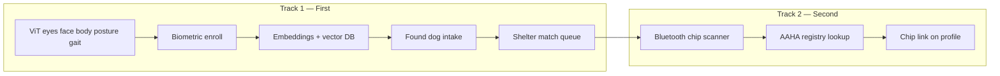

# Freedom Paws ID — Lost Dog Infrastructure, Microchip Strategy & Launch Roadmap

**Version 2.0 | June 10, 2026** — Executive summary  
**Complete master (all detail):** [`Freedom-Paws-ID-Complete-Master-Roadmap-June-2026.md`](./Freedom-Paws-ID-Complete-Master-Roadmap-June-2026.md)  
**Audience:** Founder, engineering, shelter/vet partnerships, marketing  
**Status:** Planning → **build biometric (unchipped) first**; chipped module second  
**Related:** `Freedom-Paws-ID-Founder-Review-June-2026.md` · `Freedom-Paws-Launch-Todo-Prioritized-June-2026.md` · `Framer-CTA-Link-Map.md` Section 14 · `ViT-Diagnostics-Vision-and-Roadmap.md`

---

## 1. Executive summary

Freedom Paws ID & Tool Box is the **B2B growth engine** for shelters and veterinarians. **Founder build order (locked):**

### Track 1 — Build first (unchipped / biometric)
1. **Expand ViT Diagnostics** — structured capture + analysis of **eyes, face, body, posture, and gait (video)**.
2. **Biometric ID enrollment** — multi-modal pet profile linked to My Pets.
3. **Found-dog match** — shelter uploads found dog → similarity search → human-reviewed reunion.
4. **Shelter portal (biometric)** — intake and match queue for **non-chipped** strays (majority of shelter intake in many regions).

### Track 2 — Build second (chipped)
5. **Universal microchip capture** — Bluetooth LF scanner (125 / 128 / 134.2 kHz); phones cannot read implanted chips natively.
6. **Registry routing** — AAHA lookup + AVID branch.
7. **Chip ↔ Freedom Paws profile** link as **secondary** layer on enrolled pets.

**Why this order:** Unchipped strays are the **immediate shelter pain**; ViT vision investment **powers both** wellness diagnostics and biometric re-ID; one codebase, one marketing story (“same Vision Transformer — wellness today, reunion tomorrow”).

**Milestones:**

| Milestone | Target date |
|-----------|-------------|
| **Build starts** | June 10, 2026 |
| **ViT multi-region + gait (video) beta** | August 15, 2026 (Week 9) |
| **Biometric enroll + found-dog pilot** (unchipped E2E) | **October 1, 2026** (Week 16) |
| **Chipped module complete** | January 15, 2027 (Week 27) |
| **Full infrastructure + promotion mode** | **February 1, 2027** (Week 29) |

---

## 2. Build-order diagram



---

## 3. ViT vision platform — foundation for biometric ID

Current `/diagnostics` analyzes photos for **wellness protocol** ranking. Biometric ID requires the **same engine** extended to **identity-grade regions** and **temporal gait**.

### 3.1 Vision regions (build order within Track 1)

| Region | Capture | Analysis output | Used for |
|--------|---------|-----------------|----------|
| **Eyes** | Close-up photo; quality gate (clarity, glare) | Discharge, cloudiness, squint (wellness); **periocular landmarks** (ID) | Clear Vision protocol + face match features |
| **Face** | Front-facing photo | Breed cues, stress markers; **facial geometry descriptors** | Biometric enroll primary |
| **Body** | Side + top-down photo | Coat pattern, markings, body condition | Biometric enroll; wellness |
| **Posture** | Still photo + short video frame | Stance, asymmetry, spine angle | Max Movement / spine protocols + ID posture signature |
| **Gait** | **3–5 s walking video** (existing frame extractor) | Limp, stiffness, pacing; **motion descriptor** | Mobility protocols + **video embedding** for ID |

### 3.2 Technical implementation (ViT + ID shared stack)

| Layer | File / route (existing → new) | Change |
|-------|-------------------------------|--------|
| Media quality | `lib/vit/media-quality-gate.ts` | Per-region gates (eyes, face, gait) |
| Video frames | `lib/vit/extract-video-frames.ts` | Gait-specific frame selection (mid-stride) |
| Vision prompts | `lib/ai/prompt-templates.ts` | Split: `WELLNESS_PROMPT` vs `IDENTITY_PROMPT` |
| Vision analyze | `lib/ai/vision-analyze.ts` | Multi-region JSON schema |
| Diagnostics API | `app/api/analyze/route.ts` | Mode flag: `wellness` \| `identity` \| `both` |
| Identity embeddings | `lib/id/embeddings.ts` **(new)** | Fuse region descriptors → vector |
| Vector store | Postgres + pgvector or Pinecone | `pet_embeddings` table |
| Enroll wizard | `app/id/enroll/` **(new)** | Step-through: eyes → face → body → gait video |
| Diagnostics UI | `app/diagnostics/ViTDiagnosticsClient.tsx` | Optional “Enroll for ID” path after scan |

### 3.3 Gait / video analysis spec

- **Input:** 3–5 s video, dog walking toward camera or lateral pass.
- **Extract:** 5–8 frames via existing `extract-video-frames.ts`; prefer frames with full limb extension.
- **Model:** GPT-4o-mini vision on frame strip **+** optional motion summary prompt across frames.
- **Output (identity mode):** `gaitDescriptor`, `limbSymmetry`, `postureClass` — fed to embedding pipeline, not shown as medical diagnosis.
- **Reuse:** Same upload UX as Phase 2b video diagnostics (already in repo).

---

## 4. Biometric (unchipped) module — complete spec

### 4.1 Module map (priority order)

| Priority | Module | Route | Phase |
|----------|--------|-------|-------|
| **P0** | ID Hub | `/id` | Week 3 |
| **P0** | ViT identity capture (eyes/face/body/gait) | `/diagnostics?mode=identity` + `/id/enroll` | Weeks 4–10 |
| **P0** | Biometric enroll wizard | `/id/enroll` | Weeks 8–12 |
| **P0** | Found dog report | `/id/found` | Weeks 12–14 |
| **P0** | Match review queue | `/id/match` | Weeks 14–16 |
| **P0** | Shelter dashboard (biometric) | `/id/shelter` | Weeks 14–18 |
| **P1** | Owner alerts (email → push) | notifications | Weeks 16–18 |
| **P1** | Public QR pet card | `/id/p/[slug]` | Week 6 |
| **P2** | Encrypted vault / IPFS | My Pets → Records | Week 24+ |
| **— deferred —** | Chip scan | `/id/scan` | **Week 18+** |
| **— deferred —** | Registry lookup | `/id/lookup` | **Week 20+** |
| **— deferred —** | Vet portal (chip) | `/id/vet` | **Week 24+** |

### 4.2 Data model (biometric-first)

```ts
// lib/id/types.ts — illustrative
BiometricEnrollment {
  petId, ownerId,
  status: 'draft' | 'complete' | 'consented',
  regions: {
    eyes?: { mediaId, qualityScore, descriptors },
    face?: { mediaId, qualityScore, descriptors },
    body?: { mediaId, qualityScore, descriptors },
    posture?: { mediaId, qualityScore, descriptors },
    gait?: { videoId, frameIds[], gaitDescriptor },
  },
  embeddingId,           // fused vector reference
  consentedAt, consentVersion,
  freedomPawsId, qrSlug,
}
FoundDogReport {
  shelterId?, reporterRole,
  mediaIds[], optionalNotes,
  embeddingId,           // query vector
  matchCandidates[],     // top-K refs
  reviewStatus,
}
// Deferred to Track 2:
ChipLink { petId, chipRaw, iso15?, registryHint? }
```

### 4.3 Match policy (unchipped)

1. Shelter or public submits **found dog** photos/video.
2. System generates query embedding; searches enrolled DB (cosine similarity).
3. Return **top 5** candidates — scores only to **authorized shelter reviewer**.
4. Human approves **one** candidate → owner notified (email v1; SMS v2).
5. **No auto-contact** of owner without review (legal + false-match protection).

---

## 5. Chipped module — deferred (Track 2)

*Full research retained from v1.0 — summary only.*

### 5.1 Three microchip families (US)

| Type | Frequency | Notes |
|------|-----------|--------|
| ISO FDX-B | 134.2 kHz | 15-digit global standard |
| FDX-A / AVID | 125 kHz | Legacy; AVID encrypted needs universal scanner |
| Trovan | 128 kHz | 10-digit legacy |

**Phones cannot read implanted LF RFID.** Track 2 adds **Freedom Paws Universal Scan Kit** (Bluetooth BLE/HID, $90–$200/unit).

### 5.2 Registry (AAHA + AVID branch)

- AAHA Universal Lookup — registry routing, not owner PII; partnership via petmicrochiplookup@aaha.org.
- AVID non-participant — explicit app branch.
- Chip links **onto existing** biometric profile (not a separate enroll path).

### 5.2 Track 2 starts after

- [ ] Biometric enroll live with **500+** pets in DB **OR**
- [ ] **3+** shelter pilot reunions (even manual) documented **OR**
- [ ] Week 18 calendar gate — whichever comes first.

---

## 6. Go-to-market — adoption projections (biometric-first)

### 6.1 Phase A — Biometric pilot (Oct–Dec 2026)

**Pitch to shelters:** “**40–60% of intakes are unchipped or chip unreadable.** Freedom Paws lets you photograph a found dog and search enrolled members — same AI as our live ViT platform.”

| Segment | Target | Offer | Projected uptake |
|---------|--------|-------|------------------|
| **Shelters (alpha)** | 3 partners | Free enroll + found-dog intake; no hardware | 3 signed by Oct 2026 |
| **Shelters (beta)** | 15 by Dec 2026 | Match queue + training | 60% active weekly |
| **Pet owners** | 1,500 enrollments by Dec 2026 | Free ID enroll with My Pets | Via ViT funnel + Framer |
| **Vets (awareness)** | 50 waitlist | “Biometric backup for unchipped patients” | List only — chip pitch later |

### 6.2 Phase B — Chip module launch (Jan–Feb 2027)

**Pitch expands:** “**Plus** universal scanner for all 3 chip types — one app for chipped and unchipped.”

| Segment | Target | Projected uptake |
|---------|--------|------------------|
| **Shelters** | +35 (50 total) | 2 scanners/shelter kit @ subsidized pilot |
| **Vets** | 100 active | Scanner at front desk + chip verify |
| **Scanner kits sold** | 150 by Q1 2027 | $99–$149 retail |

### 6.3 User acquisition loops (reordered)

1. **ViT Diagnostics** → “Save this scan to your pet’s ID profile” (primary).
2. **Shelter found-dog** → owner outreach → app install.
3. **Framer ID page** → `/id/enroll` (when live).
4. **Adoption packet QR** — biometric ID card.
5. **Chip scan notification** — Track 2 (PetScanner-style loop).

### 6.4 Year 1 projections (conservative)

| Metric | End 2026 (biometric) | End Q2 2027 (+ chip) |
|--------|----------------------|----------------------|
| Biometric enrollments | 2,500 | 12,000 |
| Shelter partners | 15 | 75 |
| Vet clinics (waitlist → active) | 50 → 20 | 120 |
| Documented reunions | 3–5 | 15+ |
| Scanner kits deployed | 0 | 200 |

---

## 7. Cost estimates (revised — biometric first)

### 7.1 Engineering hours (reordered)

| Workstream | Hours | When | Contract @$150/hr |
|------------|-------|------|-------------------|
| **ViT multi-region + gait video** | 140 | Weeks 1–10 | $21,000 |
| **Backend + auth + server My Pets** | 120 | Weeks 2–6 | $18,000 |
| **Biometric enroll + embeddings** | 120 | Weeks 8–14 | $18,000 |
| **Found dog + match queue** | 80 | Weeks 12–16 | $12,000 |
| **Shelter portal (biometric)** | 80 | Weeks 14–18 | $12,000 |
| **Security + load test** | 40 | Weeks 16–18 | $6,000 |
| *Subtotal Track 1* | **580** | | **~$87,000** |
| Chip scan + BLE integration | 60 | Weeks 18–22 | $9,000 |
| AAHA / registry UX | 60 | Weeks 20–24 | $9,000 |
| Vet portal (chip) | 40 | Weeks 24–27 | $6,000 |
| Scanner kit store + ops | 20 | Weeks 25–27 | $3,000 |
| *Subtotal Track 2* | **180** | | **~$27,000** |
| Legal/privacy (biometric + shelter DPA) | — | Weeks 1–8 | $10,000–$18,000 |
| **Total engineering + legal** | **760** | | **~$124,000–$132,000** |

**Founder-led development** reduces cash cost by ~$80k–$100k (time trade).

### 7.2 Hardware (deferred to Track 2)

| Item | Qty | When | Total |
|------|-----|------|-------|
| Dev scanners (engineering) | 2 | Week 18 | $240 |
| Pilot shelter kits | 30 | Week 22 | $3,600 |
| Launch inventory | 200 | Week 27 | $17,000 |
| **Hardware subtotal** | | | **~$21,000** (Q4 2026 – Q1 2027) |

Track 1 lean build: **$0 hardware**.

### 7.3 Monthly ops (at biometric launch, Oct 2026)

| Service | Low | High |
|---------|-----|------|
| Vercel + DB + pgvector | $75 | $350 |
| OpenAI (ViT wellness + identity + embeddings) | $350 | $2,500 |
| Object storage (photos/video) | $25 | $120 |
| Email (Resend) | $20 | $80 |
| **Monthly ops (biometric phase)** | **~$470** | **~$3,050** |

*Add Twilio SMS + higher scan volume after chip launch.*

### 7.4 Marketing budget (revised phases)

| Phase | Period | Focus | Budget |
|-------|--------|-------|--------|
| **Pre-pilot** | Jul–Sep 2026 | ViT + “enroll your dog’s ID” education | $2,000 |
| **Biometric pilot PR** | Oct–Dec 2026 | Shelter stories, reunion reels | $5,000 |
| **Chip launch PR** | Jan–Feb 2027 | “All 3 chip types” + scanner kit | $4,000 |
| **90-day promotion burst** | Feb–Apr 2027 | National push | $9,000 |
| **Total marketing to Q2 2027** | | | **~$20,000** |

### 7.5 Total cash (revised)

| Scenario | Track 1 only (biometric launch) | Full (biometric + chip) |
|----------|--------------------------------|-------------------------|
| **Lean** (founder builds) | **$15,000–$25,000** | **$45,000–$55,000** |
| **Recommended** (contract help) | **$55,000–$65,000** | **$125,000–$135,000** |

---

## 8. Social media marketing plan (revised)

### 8.1 Positioning pillars (biometric-first)

1. **“Unchipped isn’t unseen”** — shelter-friendly hook.
2. **ViT vision** — eyes, gait, face (show the science in Reels).
3. **Reunion stories** — consent-based, shelter-verified.
4. **Mission** — veterans + no-kill shelters (10% narrative).
5. *Later:* “3 chip types, one scanner” (Track 2).

### 8.2 Content calendar

| Weeks | Theme | CTA |
|-------|-------|-----|
| 1–6 | “What ViT sees” — eyes, face, gait clips | `/diagnostics` |
| 7–10 | Enroll your dog’s biometric ID (beta) | `/id/enroll` |
| 11–16 | Shelter pilot diaries | Shelter partner form |
| 17–22 | Reunion story series | Share + enroll |
| 23–29 | Chip module teaser → launch | `/id/kit` waitlist |

### 8.3 KPIs (revised)

| Metric | Oct 2026 (biometric pilot) | Feb 2027 (full launch) |
|--------|---------------------------|------------------------|
| Biometric enrollments | 500 | 3,000 |
| Shelter pilots active | 3 | 20 |
| Found-dog reports processed | 25 | 200 |
| Confirmed reunions | 1 | 5+ |
| Vet waitlist | 30 | 150 |
| Chip lookups (Track 2) | — | 500/mo |

---

## 9. Technical roadmap & timeline (29 weeks)

**Start:** June 10, 2026  

### Phase 0 — Foundation (Weeks 1–2)

| Task | Deliverable |
|------|-------------|
| Approve v2.0 build order (biometric first) | This document signed off |
| Biometric consent + false-match policy draft | Legal input |
| `lib/id/types.ts` + `app/id/` scaffold | Repo structure |
| Identity vision JSON schema design | `lib/ai/types.ts` extension |
| Server My Pets migration plan | Auth + Postgres choice |

**Exit:** Ready to code Track 1.

### Phase 1 — Server My Pets + ID hub (Weeks 2–5)

| Task | Deliverable |
|------|-------------|
| Auth + Postgres pet profiles | Cross-device My Pets |
| `/id` hub | Links to enroll, found (chip grayed “coming soon”) |
| `/id/p/[slug]` QR card | Owner-controlled visibility |

### Phase 2 — ViT multi-region vision (Weeks 3–10)

| Task | Deliverable |
|------|-------------|
| Per-region quality gates | eyes, face, body |
| Identity prompt + API mode `identity` | Structured region descriptors |
| Gait video pipeline | 3–5 s video → frames → gait descriptor |
| Diagnostics UI: “Save to ID profile” | Bridge wellness → enroll |
| Posture analysis in still + video | Posture class for mobility + ID |

**Exit:** ViT can scan eyes, face, body, posture, gait for identity-grade capture.

### Phase 3 — Biometric enrollment (Weeks 8–12)

| Task | Deliverable |
|------|-------------|
| `/id/enroll` wizard | Step-through all regions |
| Consent capture | Versioned terms + timestamp |
| Embedding fusion + pgvector | `pet_embeddings` live |
| My Pets → ID tab | Enrollment status per pet |

**Exit:** Owner completes full biometric enroll.

### Phase 4 — Found dog + match (Weeks 12–16) — **biometric pilot gate**

| Task | Deliverable |
|------|-------------|
| `/id/found` intake | Photo/video upload |
| Similarity search top-K | Shelter-only scores |
| `/id/match` review UI | Human approve/reject |
| Owner email alert | On approved match |

**Exit:** **October 1, 2026** — unchipped E2E pilot with 1–3 shelters.

### Phase 5 — Shelter portal + hardening (Weeks 14–18)

| Task | Deliverable |
|------|-------------|
| `/id/shelter` dashboard | Intake list, match history |
| Role-based access | shelter_admin, owner |
| Security review | PII encryption, audit logs |
| Load test | 5k pets, 500 concurrent searches |

### Phase 6 — TRACK 2 BEGINS: Chip capture (Weeks 18–22)

| Task | Deliverable |
|------|-------------|
| Order universal Bluetooth scanners | 2 dev + 30 pilot |
| `/id/scan` HID/BLE input | 125/128/134.2 kHz strings |
| Chip parser + link to profile | Attach to biometric enroll |
| Scan audit log | Timestamp, actor |

### Phase 7 — Registry lookup (Weeks 20–24)

| Task | Deliverable |
|------|-------------|
| AAHA lookup integration | Registry routing UI |
| AVID branch | Non-participant education |
| Shelter chip + biometric unified intake | One found-dog form |

### Phase 8 — Launch prep + promotion (Weeks 25–29)

| Task | Deliverable |
|------|-------------|
| Scanner kit store SKU | `{APP}/id/kit` |
| Framer copy: biometric live + chip live | Remove “coming soon” per feature |
| Case study video | Shelter reunion |
| National promotion mode | **February 1, 2027** |

---

## 10. Parallel work (unchanged priority)

| Item | When |
|------|------|
| Framer ID page finish + publish | Weeks 1–2 |
| Token Shop / XUMM testing | Weeks 2–4 |
| Monitor MVP | Weeks 12+ (parallel) |
| Photo Booth Phase 2 | Weeks 16+ |

---

## 11. Risk register (updated)

| Risk | Mitigation |
|------|------------|
| Biometric false match | Human review queue; confidence thresholds; no auto PII |
| ViT gait variance (lighting, leash) | Quality gate + re-record UX |
| Shelter adoption without chip | **Biometric-first pitch** — chip is additive |
| Marketing overclaims ID match before Phase 4 | Framer copy until Oct 2026 gate |
| Chip module delay | Shelters still get value from Track 1 |
| OpenAI cost at video scale | Frame cap; `detail: low`; cache descriptors |

---

## 12. Success criteria (phased)

### Biometric launch gate (Oct 1, 2026)

| Capability | Done when |
|------------|-----------|
| ViT regions | Eyes, face, body, posture, gait video analyzed |
| Enroll | Owner completes wizard + consent |
| Found dog | Shelter submits → top-K candidates |
| Reunion | Human-approved match → owner notified |
| Shelters | ≥3 pilots active |

### Full launch gate (Feb 1, 2027)

| Capability | Done when |
|------------|-----------|
| All biometric criteria | Sustained at 15+ shelters |
| 3 chip types | Universal scanner → app |
| Registry routing | AAHA + AVID branch |
| Scanner kits | Available for purchase |
| Marketing | No false “phone scans chip” claims |

---

## 13. Immediate next actions (this week)

1. **Founder:** Confirm v2.0 build order (biometric → chip).
2. **Eng:** Scaffold `app/id/`, extend `lib/ai/types.ts` for identity regions.
3. **Eng:** Spec gait video UX in `ViTDiagnosticsClient` + enroll wizard wireframe.
4. **Legal:** Biometric consent template (priority over chip).
5. **Marketing:** Draft “unchipped isn’t unseen” shelter one-pager.
6. **Defer:** Scanner OEM order → **Week 18**.

---

## 14. Document changelog

| Version | Date | Notes |
|---------|------|-------|
| 1.0 | 2026-06-10 | Initial research; chip + biometric parallel |
| 2.0 | 2026-06-10 | **Biometric first**; ViT eyes/face/body/posture/gait; chip Track 2; revised costs, timeline, adoption |

---

*Freedom Paws ID is not a government pet license. Not veterinary advice. Biometric enrollment requires explicit consent. Match results require human review before owner contact.*
