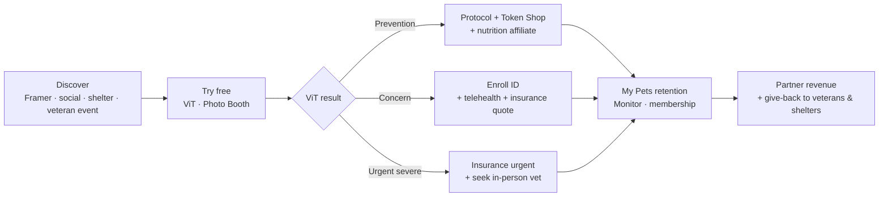
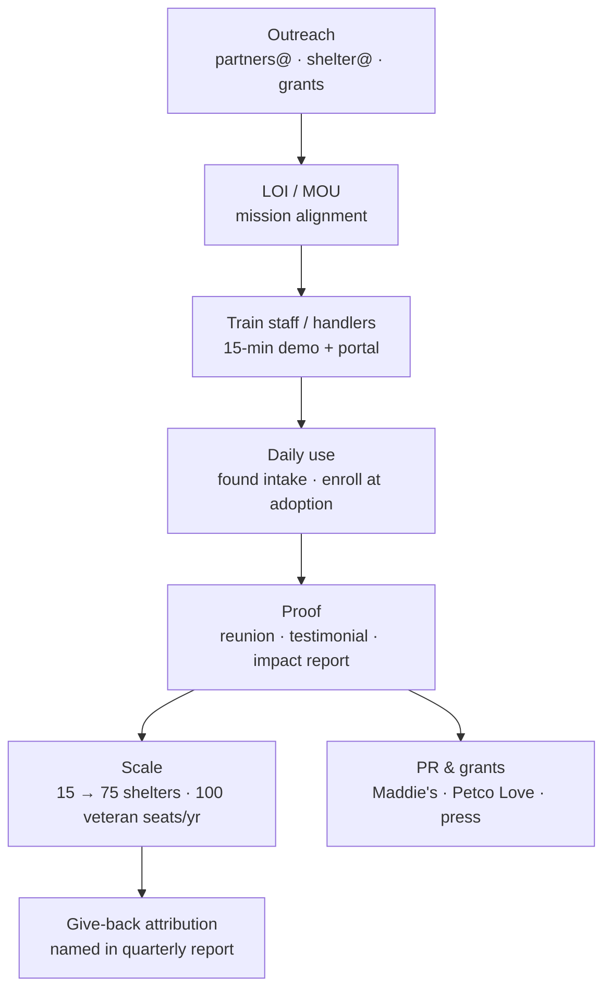

# Freedom Paws Wellness — Partner Acquisition & Mission Marketing Plan

**Date:** June 13, 2026 · **Nutrition update:** July 24, 2026  
**Purpose:** Best-practice playbook to find, vet, and onboard mission-aligned partners — and recruit shelters & veteran organizations for adoption and utilization  
**Audience:** Founder, outreach lead, future BD hire  
**Related:** [Partner Policies](./Freedom-Paws-Wellness-Partner-Policies-June-2026.md) · [Super-App Strategy](./Freedom-Paws-Super-App-WeChat-Strategy-June-2026.md) · [Competitive Analysis](./Freedom-Paws-Competitive-Market-Dominance-and-5-Year-Model-June-13-2026.md) · [Framer CTA Map](./Framer-CTA-Link-Map.md) · **[Verified Dog Health Partners Outreach Plan](./Freedom-Paws-Verified-Dog-Health-Partners-Outreach-Plan-July-2026.md)**  
**Apply / outreach hub:** partners@freedompawsinc.com · shelter@freedompawsinc.com

> **July 2026:** Nutrition / supplement / treat / chew partners use the Verified Partners evaluation framework and Wave 1 list. Soft outreach OK now; live affiliate CTAs after L5.

---

## Table of contents

1. [Executive summary](#1-executive-summary)
2. [Marketing principles (mission-first)](#2-marketing-principles-mission-first)
3. [Partner category playbooks](#3-partner-category-playbooks)
4. [Module roadmaps & checklists](#4-module-roadmaps--checklists)
5. [Best outreach sources by category](#5-best-outreach-sources-by-category)
6. [Recruitment: shelters & veteran groups](#6-recruitment-shelters--veteran-groups)
7. [90-day outreach calendar](#7-90-day-outreach-calendar)
8. [KPIs & success metrics](#8-kpis--success-metrics)
9. [Organization funnel flowchart](#9-organization-funnel-flowchart)

---

## 1. Executive summary

Freedom Paws grows through **trust-first distribution**: daily utility (ViT, My Pets, ID) → wellness education (protocols) → **mission-aligned partners** (insurance, holistic telehealth, clean nutrition, safe products) → **shelter & veteran channels** for proof, PR, and give-back impact.

**Do not spray generic affiliate networks.** Prioritize partners who accept our wellness-first positioning (no pharma-first co-marketing), offer **member-exclusive savings**, and align with **10% give-back** (50% veteran dog orgs / 50% shelters).

**2026 priority order:**

| Priority | Category | Why first |
|:--------:|----------|-----------|
| 1 | **Pet insurance affiliate** | Highest $/conversion; pairs with ViT urgent + ID |
| 2 | **Holistic telehealth** | Closes ViT → consult loop; weekly retention |
| 3 | **Shelter pilot (Tennessee)** | Reunion proof = national credibility |
| 4 | **Veteran dog organizations** | Mission moat + B2B2C seats |
| 5 | **Protocol / whole-food affiliates** | Supports Token Shop + education |
| 6 | **Non-toxic chews & toys** | Low-friction affiliate; allergy/gut cross-sell |

---

## 2. Marketing principles (mission-first)

### Non-negotiables (every partner conversation)

| Principle | What we say | What we reject |
|-----------|-------------|----------------|
| **Wellness, not pharma** | Prevention, lifestyle, non-toxic nutrition, protocols | Partners requiring drug-first treatment messaging |
| **Evidence-based selection** | We evaluate sourcing, contaminant testing, manufacturing, scientific integrity — we only recommend companies that meet our standards | Spray-and-pray affiliate networks; pay-to-rank listings |
| **Member value** | Exclusive discount/credit via Freedom Paws link | “Same price as website” affiliate deals |
| **Transparent disclosure** | FTC-compliant “may earn commission” on all CTAs | Hidden referral relationships |
| **Optional CTAs** | Partners enhance; never block ViT/ID/core app | Paywalls on diagnostics or ID enroll |
| **Give-back story** | 10% eligible net → veterans + shelters; Community Partners amplify documented impact | Overclaiming charity ties without documentation |
| **Emergency honesty** | ViT ≥80% severe congruency → in-person vet | Telehealth partners discouraging ER referral |

### Best-practice outreach sequence (all categories)

```
Research (mission fit) → Warm intro or targeted email → 15-min alignment call
→ Share /wellness/partners standards → Legal + tracked links → QA in app funnels
→ Soft launch → 30-day metrics review → Scale or decline
```

### Collateral to send every partner

1. Link: `https://app.freedompawsinc.com/wellness/partners` (or insurance/telehealth subpage)
2. One-pager: Buddy’s Legacy + 10 protocols + ID pilot (PDF or Framer mission page)
3. Funnel diagram (Section 9 of this doc)
4. Proposed financial structure from [Partner Policies](./Freedom-Paws-Wellness-Partner-Policies-June-2026.md)

---

## 3. Partner category playbooks

### 3A. Pet insurance affiliates

**Goal:** 1 primary + 1 backup affiliate live by Q4 2026 with quote, lost-dog, and urgent-care deep links.

| Step | Action | Owner | Done when |
|:----:|--------|-------|-----------|
| 1 | Apply to 3–5 affiliate programs (see Section 5) | Founder | Applications submitted |
| 2 | Negotiate member discount (≥5%) + lost-pet rider tracking | Founder | Term sheet draft |
| 3 | Legal review affiliate agreement + FTC disclosure | Counsel | Approved language in app |
| 4 | Configure env vars (`NEXT_PUBLIC_FP_INSURANCE_*`) | Engineering | `/api/wellness/config-status` green |
| 5 | QA ViT urgent → insurance CTA; ID complete → lost-dog URL | QA | Screenshots logged |
| 6 | Announce on Framer + email waitlist | Marketing | Live link |

**Pitch angle:** “Only **3–4%** of U.S. dogs insured — your product meets owners at **AI concern moments** and **ID enrollment**, not cold search.”

**Required URLs:** `QUOTE_URL` · `LOST_DOG_URL` · `URGENT_URL` (or fallbacks documented)

---

### 3B. Holistic telehealth partners

**Goal:** 1 integrative/holistic vet telehealth partner by Q1 2027; booking link in all WellnessPartnerPanel surfaces.

| Step | Action | Owner | Done when |
|:----:|--------|-------|-----------|
| 1 | Shortlist AHVMA-aligned platforms (Section 5) | Founder | 5 targets |
| 2 | Verify DVM licensing + Tennessee pilot market coverage | Partner | Written confirmation |
| 3 | Confirm emergency escalation policy in writing | Legal | Clause approved |
| 4 | Negotiate $15–35/consult referral + ≥10% member discount | Founder | Signed referral deal |
| 5 | Configure `NEXT_PUBLIC_FP_TELEHEALTH_*` | Engineering | Live booking link |
| 6 | Co-marketing: “Holistic consult after ViT” copy on `/wellness` | Marketing | Published |

**Pitch angle:** “We route **mild/moderate** cases to wellness protocols; we refer **concern** cases to **you** — not ER telehealth mills.”

---

### 3C. Protocol & whole-food affiliates

**Goal:** Affiliate links inside 3 protocols by H1 2027; expand to 8 by 2028.  
**Master plan:** [Verified Dog Health Partners Outreach Plan](./Freedom-Paws-Verified-Dog-Health-Partners-Outreach-Plan-July-2026.md) — Wave 1, tiers, charity flags, email template.

| Protocol | Affiliate type | Example congruent brands |
|----------|----------------|--------------------------|
| Gut Balance | Whole-food / probiotic | Honest Kitchen, Open Farm, Adored Beast, Four Leaf Rover |
| Max Movement | Joint / anti-inflammatory nutrition | Fera Pets, Four Leaf Rover (whole-food) |
| Allergy Shield | Limited-ingredient / fresh food | Raised Right, JustFoodForDogs, Green Juju |
| Fresh Smile | Dental chews (non-toxic) | Whimzees (Safe Picks); Farm Hounds where SKU-fit |
| Liver/Kidney Detox | Clean protein / hydration | Open Farm, Green Juju (functional) |
| Freedom Calm | Calming supplements (natural) | Adored Beast / holistic — **no synthetic pharma** |
| Patriot Immune | Senior / immune + give-back story | Honest Kitchen, Nordic Naturals (omega education) |
| Clear Vision | Eye-support nutrition | Limited — vet-reviewed only |

| Step | Action | Done when |
|:----:|--------|-----------|
| 1 | Score brand on Verified framework (sourcing, testing, manufacturing, science, ethics, giving) | Approved list per protocol |
| 2 | Soft Wave 1 outreach (charity-aligned first); apply programs **after L5** | Tracking links |
| 3 | Add “Verified / whole-food partners” block on `/protocols/{slug}` | Live on 3 slugs |
| 4 | Disclose affiliate; cross-link Token Shop | Legal + UX review |
| 5 | Offer educational collab (review / webinar), not links only | Partner agrees |
| 6 | Track clicks in analytics; monthly report | Dashboard |

**Rule:** Never affiliate products that contradict **non-toxic, whole-food / evidence-based** positioning without founder exception. Never claim shelter/veteran support for a brand without a documented program.

---

### 3D. Non-toxic chews, toys & environmental products

**Goal:** Curated “Freedom Paws Safe Picks” affiliate page by H2 2027.

**Criteria for products**

- USA or transparent sourcing; no recalled history (check FDA pet recall DB)
- No rawhide (controversy); prefer digestible or rubber/silicone
- No phthalates / BPA in toys; washable beds; non-toxic cleaners for “environment” pillar
- Align with ViT signals: allergy → hypoallergenic chew; dental → VOHC-approved if claimed

| Step | Action | Done when |
|:----:|--------|-----------|
| 1 | Build approved vendor list (Section 5) | 10+ SKUs vetted |
| 2 | Create `/wellness/safe-products` or section on `/wellness` | Page live |
| 3 | Funnel from ViT allergy/dental results | Panel link |
| 4 | Quarterly recall audit | Calendar reminder |

---

### 3E. Shelter recruitment → utilization

**Goal:** 6 active Tennessee pilot partners by Oct 2026; 15 by end 2026; 75 by Year 5.

| Step | Action | Done when |
|:----:|--------|-----------|
| 1 | Identify 20 target shelters (Section 6) | CRM list |
| 2 | Send pilot kit: ID portal, found-dog flow, 50 free enrollments/event | LOI signed |
| 3 | Train staff (15-min Loom + `/id/shelter`) | 3 shelters trained |
| 4 | First found-dog intake → match test | E2E documented |
| 5 | First **public reunion story** | Press + social |
| 6 | Quarterly give-back report naming partners | Published on Framer grants |

**Shelter value prop:** Free intake tool, biometric match for unchipped dogs, optional scanner kit path (Track 2), PR for adoptions.

---

### 3F. Veteran dog organization recruitment

**Goal:** 2 signed co-marketing partners by 2027; 100 sponsored member seats/year.

| Step | Action | Done when |
|:----:|--------|-----------|
| 1 | Outreach to Tier 1 orgs (Section 6) | 5 meetings |
| 2 | Offer sponsored Freedom Paws access (Patriot Immune bundle) | MOU draft |
| 3 | Co-branded landing on Framer `/veterans` → app | Live CTAs |
| 4 | Track give-back attribution to org | Quarterly statement |
| 5 | Veteran handler testimonial (ViT + ID) | Video published |

**Veteran value prop:** Service dog wellness vault, ViT before vet visits, mission give-back transparency, lake-meetup community (future).

---

## 4. Module roadmaps & checklists

### Master module checklist (marketing + partner readiness)

| Module | App route | Marketing status | Partner tie-in | Checklist |
|--------|-----------|------------------|----------------|-----------|
| **ViT Diagnostics** | `/diagnostics` | Framer hero CTA | Insurance urgent; telehealth concern; protocol shop | ☐ Framer “Try ViT free” live ☐ 3 symptom SEO posts ☐ Vet clinic QR cards (10) |
| **Freedom Paws ID** | `/id`, `/id/enroll` | Framer ID block | Insurance lost-dog URL | ☐ Hero enroll CTA ☐ Shelter pilot LOIs (3) ☐ First reunion PR |
| **Wellness partners** | `/wellness` | Partner program page public | Insurance + telehealth | ☐ 1 insurer signed ☐ 1 telehealth signed ☐ Config-status green |
| **10 Protocols** | `/protocols`, `/protocols/[slug]` | Framer protocol grid | Whole-food affiliates | ☐ Learn More → Framer ☐ Buy → token-shop ☐ 3 affiliate links |
| **Token Shop** | `/token-shop` | Nav + Connect Wallet | XRPL treasury; give-back | ☐ Framer Token Shop CTA ☐ Xaman flow tested ☐ Give-back formula counsel |
| **My Pets** | `/mypets` | App-only | Cloud sync → ID enroll | ☐ Sign-in prompt copy ☐ Wellness panel visible |
| **SuperBud Photo Booth** | `/photobooth` | Social viral | Acquisition (low CAC) | ☐ UGC contest ☐ 2 Reels/week ☐ Adoption day kits |
| **Monitor My Dog** | `/monitor` | App + help page | Wyze affiliate (optional) | ☐ Setup guide SEO ☐ Relay beta invite list |
| **Shelter portal** | `/id/shelter`, `/id/found` | B2B outreach | Shelter recruitment | ☐ 3 pilots trained ☐ shelter@ email live ☐ Stats dashboard demo |
| **Membership** | (roadmap) | Founding 500 campaign | Recurring LTV | ☐ $9.99/mo Stripe live ☐ Terms updated ☐ Launch email |
| **Framer marketing site** | freedompawsinc.com | Primary acquisition | All funnels | ☐ DNS custom domain ☐ All CTAs mapped ☐ No nested link errors |

---

### Roadmap by quarter (marketing + partners)

| Quarter | Insurance | Telehealth | Nutrition/affiliates | Shelters | Veterans | Core marketing |
|---------|-----------|------------|----------------------|----------|----------|----------------|
| **Q3 2026** | Apply + sign 1 | Shortlist + calls | Research list | 3 pilot LOIs | Intro emails | Framer CTAs; ViT hero; founding waitlist |
| **Q4 2026** | Live in app | Term sheet | 1 protocol affiliate | Pilot live Oct 1 | 1 MOU | Reunion PR; grant LOI |
| **Q1 2027** | Optimize CPA | Live booking | 3 protocol links | 6 active | Sponsored seats | Founding 500 launch |
| **Q2 2027** | 2nd insurer backup | Co-marketing | Safe chews page draft | 10 active | Veteran webinar | Email newsletter |
| **Q3 2028** | Scale spend | Subscription tier | 8 protocols | 20 active | 100 seats/yr | Regional press |
| **2029+** | Co-branded Protect | Own triage layer? | Private label food? | 75+ | National org | Paid ads if CAC OK |

---

## 5. Best outreach sources by category

*Prioritized for mission congruence: holistic, transparent, veteran/shelter friendly, non-pharma-first.*

### Pet insurance — affiliate & strategic

| Priority | Organization | Why congruent | How to reach |
|:--------:|--------------|---------------|--------------|
| ★★★ | **Embrace Pet Insurance** | Strong affiliate program; wellness-friendly branding | embracepetinsurance.com/affiliates |
| ★★★ | **Pets Best** | Established CPA; shelter community ties | petsbest.com affiliate team |
| ★★★ | **Spot Pet Insurance** | Growth brand; digital-first | spotpetinsurance.com partners |
| ★★ | **Fetch (formerly Petplan)** | Premium segment; lost-pet messaging | Impact.com / direct BD |
| ★★ | **Lemonade Pet** | Tech-forward; affiliate via network | Lemonade partners program |
| ★★ | **Figo Pet Insurance** | App-native; may align with PWA | figo affiliate |
| ★ | **ASPCA Pet Health Insurance** | Mission overlap (verify give-back compatibility) | Crum & Forster affiliate channel |
| Network | **Impact.com**, **CJ Affiliate**, **ShareASale** | Discovery only — **vet each insurer** | Search “pet insurance” after mission filter |

**Avoid as primary:** Lead-gen sites with undisclosed carrier rotation; insurers requiring pharma-heavy co-marketing.

---

### Holistic telehealth & integrative vets

| Priority | Organization | Why congruent | How to reach |
|:--------:|--------------|---------------|--------------|
| ★★★ | **AHVMA** (American Holistic VMA) | Directory of integrative DVMs | ahvma.org — conference sponsor / member referral |
| ★★★ | **Vetster** (integrative filter) | Marketplace; per-consult fees | vetster.com business development |
| ★★ | **AirVet** | Telehealth scale; negotiate holistic subset | airvet.com partnerships |
| ★★ | **Holistic Vet Connect** / regional integrative clinics | Direct Tennessee practitioners first | Cold email + ViT demo |
| ★★ | **Pawsitive Wellness**-type integrative tele-practices | Small practices — flexible rev share | Local search + Instagram DVMs |
| ★ | **University integrative programs** (e.g. UF integrative med) | Credibility; not always commercial | Academic partnership letter |

**Screening question:** “What % of consults end in prescription-only plans vs. nutrition/lifestyle plans?” Target **>50% lifestyle** for Freedom Paws fit.

---

### Protocol / whole-food & supplement affiliates

*Wave 1 order and charity notes: [Verified Partners Plan §7](./Freedom-Paws-Verified-Dog-Health-Partners-Outreach-Plan-July-2026.md).*

| Priority | Brand | Protocol fit | Affiliate channel |
|:--------:|-------|--------------|-------------------|
| ★★★ | **The Honest Kitchen** | Gut, immune, treats; Community Partner candidate | Partner With Us / ShareASale |
| ★★★ | **Open Farm** | Gut, allergy, ethical sourcing; Community | Partnership / Impact |
| ★★★ | **Farm Hounds** | Treats / chews; regenerative + rescue | Direct |
| ★★★ | **Raised Right** | Fresh food; Community candidate | Direct |
| ★★★ | **Four Leaf Rover** | Educational supplements | Direct |
| ★★★ | **Adored Beast** | Holistic supplements; founder outreach | Direct |
| ★★★ | **Nordic Naturals Pet** | Omega education; service-adjacent giving | Affiliate / contact |
| ★★★ | **Green Juju** | Fresh / functional; Community candidate | Direct |
| ★★★ | **JustFoodForDogs** | Vet nutrition; Community candidate | Direct |
| ★★★ | **Standard Process Vet** | Practitioner education (not lifestyle affiliate) | BD / practitioner |
| ★★ | **Fera Pets** | Immune, joint (verify ingredients) | Direct |
| ★★ | **Carna4 / Nature's Logic** | Whole-food / minimally processed | Direct |
| ★ | **Chewy** (select SKUs only) | Scale; **curate SKUs only** | Use sparingly |
| ★ | **Amazon Associates** | Last resort; strict SKU whitelist | Associates central |

---

### Non-toxic chews, toys & environment

| Priority | Brand | Category | Notes |
|:--------:|-------|----------|-------|
| ★★★ | **West Paw** | Toys (Zogoflex, USA) | Durable, non-toxic |
| ★★★ | **Planet Dog** | Toys | Orbee-Tuff; mission-friendly |
| ★★★ | **Whimzees** | Dental chews | Simple ingredients |
| ★★ | **Benebone** | Chews | Monitor allergy signals |
| ★★ | **Kong** (natural line) | Enrichment | Classic; vet-approved moderate |
| ★★ | **Purina Beyond / clean label lines** | Treats | Vet against protocol purity rules |
| ★★ | **iHerb pet** | Supplements | Holistic SKUs only |
| ★ | **Wyze** | Monitor hardware | Monitor My Dog setup guide affiliate |
| Env | **Branch Basics**, **Force of Nature** | Non-toxic cleaners | Environment lifestyle pillar |

---

### Member acquisition — highest signup & adoption sources

| Priority | Channel | Funnel entry | Tactics |
|:--------:|---------|--------------|---------|
| ★★★ | **Instagram / Reels** | ViT, Photo Booth | 3×/week; reunion stories; ViT before/after |
| ★★★ | **Shelter adoption events** | ID enroll, Photo Booth | QR to `/id/enroll`; free enroll codes |
| ★★★ | **Facebook senior-dog & breed groups** | ViT, protocols | Helpful posts — no spam; founder story |
| ★★ | **TikTok** | Photo Booth, ViT | SuperBud themes; 2×/week |
| ★★ | **Local holistic vets (10 clinics)** | ViT QR card | “Try free AI wellness scan” |
| ★★ | **Veteran org newsletters** | Patriot Immune, ID | Sponsored seats; give-back transparency |
| ★★ | **Pet influencers (rescue-focused)** | All modules | Micro-influencers > mega |
| ★ | **Reddit** r/dogs, r/dogadvice | ViT | Genuine help only; follow rules |
| ★ | **YouTube Shorts** | Protocol tips | Cross-link Framer |
| ★ | **Grant foundations** | Credibility | Petco Love, Maddie’s Fund — see shelters |
| ★ | **Podcasts (pet wellness)** | Brand | Guest spots Year 2+ |

**Avoid:** Paid Facebook broad pet ads until CAC < 3× LTV; generic pet spam groups; pharma-aligned vet chains for co-marketing.

---

## 6. Recruitment: shelters & veteran groups

### Shelter targets — Tennessee (pilot — active)

| Priority | Organization / type | Why |
|:--------:|---------------------|-----|
| ★★★ | **Memphis Animal Services**, **Metro ACC**, **Young-Williams** | TN Adoption Network municipal partners (live in app) |
| ★★★ | **Humane Society of Sumner County**, **New Leash on Life**, **Safe Place for Animals** | TN private pilot partners (live in app) |
| ★★★ | **Humane Society of Tennessee Valley** | Regional hub (expansion) |
| ★★ | **Smoky Mountain area rescues** | Buddy's Legacy geography |
| ★★ | **Agency rescue coalitions** | Multi-org training one session |

### Shelter targets — future expansion (post-TN pilot)

| Priority | Organization / type | Why |
|:--------:|---------------------|-----|
| ★★★ | **Best Friends Network** partners | No-kill alignment; national PR after TN proof |
| ★★ | **West Coast municipal / county shelters** | After first public reunion story |
| ★ | **State shelter associations (national)** | Conference announcements when expanding |

### Shelter grants & credibility (apply, not “partner sell”)

| Source | Use |
|--------|-----|
| **Petco Love** | Adoption + ID pilot funding |
| **Maddie’s Fund** | Foster/intake innovation |
| **ASPCA** | Select grants; align mission carefully |
| **State shelter associations** | TN first — pilot announcements; expand after reunion proof |

---

### Veteran & service dog organizations

| Priority | Organization | Why congruent | Outreach |
|:--------:|--------------|---------------|----------|
| ★★★ | **K9s For Warriors** | Service dogs; wellness + PTSD narrative | Corporate partnerships team |
| ★★★ | **America’s VetDogs** | Guide/service dogs | Sponsored member program |
| ★★★ | **Paws for Purple Hearts** | Veteran healing | Co-branded Patriot Immune |
| ★★ | **Warrior Canine Connection** | Mission alignment | Grant + software pilot |
| ★★ | **VFW / American Legion** (local posts) | Community events | Lake meetup + Photo Booth |
| ★★ | **DAV (Disabled American Veterans)** | Outreach events | Give-back reporting |
| ★ | **Patriot PAWS** | Service dogs Texas+ | Expand after TN/CA |
| ★ | **Wounded Warrior Project** (verify pet programs) | Brand adjacency | Careful compliance review |

**Offer template:** 10–25 sponsored memberships/year + public give-back attribution + free ID enroll at events.

---

## 7. 90-day outreach calendar (starting June 2026)

| Week | Insurance | Telehealth | Nutrition affiliate | Shelters | Veterans |
|------|-----------|------------|---------------------|----------|----------|
| 1–2 | Apply Embrace, Pets Best, Spot | List 5 AHVMA telehealth targets | Apply Honest Kitchen, Open Farm | Email 6 TN pilot shelters | Email K9s For Warriors, VetDogs |
| 3–4 | Follow-up calls | 2 intro calls | — | 3 discovery calls | 1 intro call |
| 5–6 | Negotiate discount + URLs | Share partner standards PDF | 1 link live on Gut Balance | Sign 1 LOI | Draft MOU |
| 7–8 | Legal review | Legal review | Apply West Paw affiliate | Train pilot staff | Veteran Framer CTA |
| 9–10 | **Go live in app** | Term sheet signed | Whimzees / dental protocol | Oct 1 pilot prep | Announce sponsored seats |
| 11–12 | Measure CPA | Target go-live | Safe products research doc | First intake test | Co-branded post |
| 13 | Optimize ViT funnel | Live booking QA | 2nd protocol affiliate | Reunion story push | Q3 give-back preview |

---

## 8. KPIs & success metrics

| Category | KPI (90-day) | KPI (12-month) |
|----------|--------------|----------------|
| Insurance | 1 live partner; 50 quote clicks | 200 quotes; 20+ policies (~$1K+ affiliate) |
| Telehealth | 1 signed deal | 100 booked consults |
| Nutrition affiliates | 3 protocol links | 500 affiliate clicks |
| Safe products | Vendor list approved | Page live + 200 clicks |
| Shelters | 3 pilots trained | 6 active; 1 reunion |
| Veterans | 1 MOU | 50 sponsored seats used |
| App adoption | 350 total members | 1,400 members; 280 paying |
| Framer | All P0 CTAs wired | Custom domain live |

---

## 9. Organization funnel flowchart

### Master map: outreach → modules → revenue & mission

```mermaid
flowchart TB
  subgraph ACQUIRE["Acquisition channels"]
    FRAMER["Framer marketing site\nfreedompawsinc.com"]
    SOC["Social: IG / TikTok / FB groups"]
    SHELTER_EVT["Shelter adoption events"]
    VET_EVT["Veteran org events"]
    VET_QR["Holistic vet clinic QR cards"]
    REF["Referral / word of mouth"]
  end

  subgraph APP["Freedom Paws PWA — app.freedompawsinc.com"]
    HOME["Home hub /"]
    VIT["ViT Diagnostics\n/diagnostics"]
    ID["Freedom Paws ID\n/id → /id/enroll"]
    MYPETS["My Pets vault\n/mypets"]
    PROTO["10 Protocols\n/protocols"]
    SHOP["Token Shop\n/token-shop"]
    WELL["Wellness hub\n/wellness"]
    BOOTH["SuperBud Photo Booth\n/photobooth"]
    MON["Monitor My Dog\n/monitor"]
    SHELTER_APP["Shelter portal\n/id/shelter · /id/found"]
  end

  subgraph PARTNERS["Partner & affiliate funnels"]
    INS["Insurance affiliate\nquote · lost-dog · urgent"]
    TEL["Holistic telehealth\nbook consult"]
    FOOD["Whole-food affiliates\nper protocol"]
    SAFE["Non-toxic chews & toys\n/wellness safe picks"]
  end

  subgraph MISSION["Mission outcomes"]
    GIVE["10% give-back\n50% veterans · 50% shelters"]
    REUNION["Lost-dog reunion\nID + shelter match"]
    EDU["Wellness education\nprevention first"]
  end

  FRAMER --> HOME
  FRAMER --> VIT
  FRAMER --> ID
  FRAMER --> SHOP
  SOC --> VIT
  SOC --> BOOTH
  SHELTER_EVT --> ID
  SHELTER_EVT --> SHELTER_APP
  VET_EVT --> PROTO
  VET_EVT --> ID
  VET_QR --> VIT
  REF --> HOME

  VIT -->|"mild/moderate"| PROTO
  VIT -->|"concern ≥72%"| ID
  VIT -->|"urgent ≥80% severe DB"| INS
  VIT -->|"concern / prevention"| TEL
  VIT --> SHOP

  ID --> INS
  ID --> TEL
  ID --> SHELTER_APP

  MYPETS --> ID
  MYPETS --> WELL
  MYPETS --> PROTO

  PROTO --> SHOP
  PROTO --> FOOD
  PROTO --> SAFE

  WELL --> INS
  WELL --> TEL
  WELL --> FOOD

  SHOP --> GIVE
  INS --> GIVE
  TEL --> GIVE
  FOOD --> GIVE

  SHELTER_APP --> REUNION
  ID --> REUNION
  VIT --> EDU
  PROTO --> EDU
  WELL --> EDU

  BOOTH --> SOC
  MON --> MYPETS
```



### Simplified funnel (owner journey)



### B2B parallel funnel (shelters & veterans)



---

## Document control

| Item | Detail |
|------|--------|
| **Date** | June 13, 2026 |
| **Owner** | Freedom Paws founder / partnerships |
| **In-app partner standards** | `/wellness/partners` |
| **Next review** | September 2026 (post Oct 1 ID pilot) |
| **Disclaimer** | Organization names are outreach targets, not endorsements or existing partnerships unless signed. Verify affiliate terms and mission fit before launch. |

---

*Freedom Paws Wellness — Honor Buddy's Legacy*
