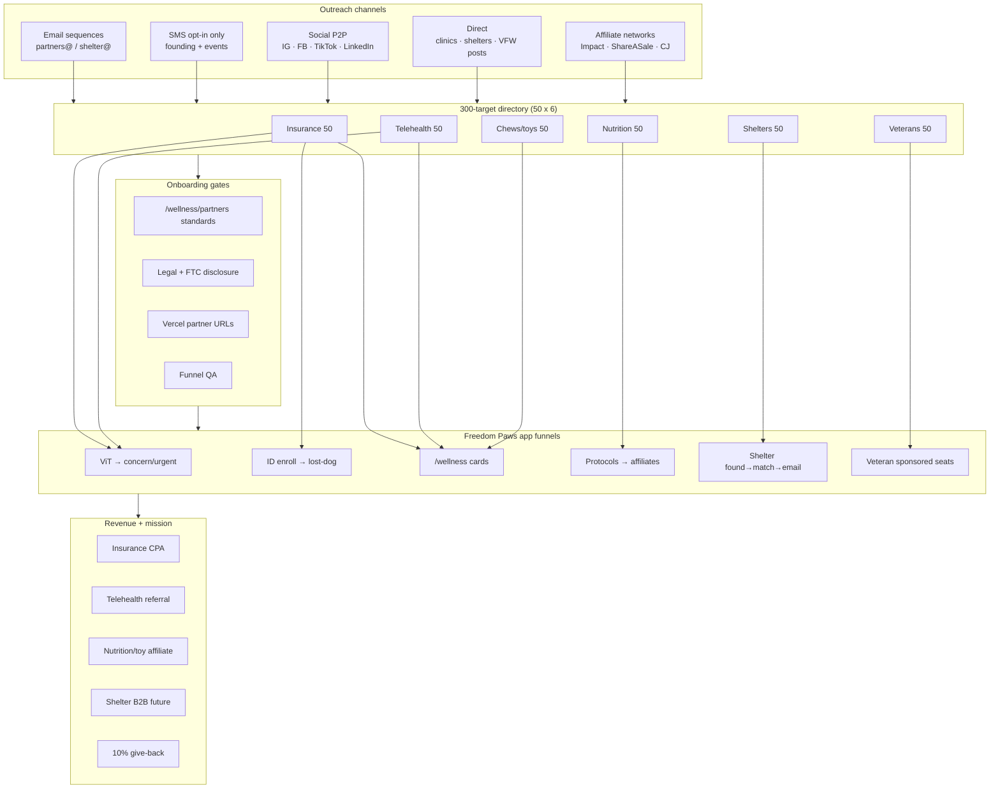

# Freedom Paws — Partner & Affiliate Acquisition Roadmap, Contact Directory & Outreach Playbook

**Date:** June 13, 2026  
**Prepared for:** Founder / BD — nationwide partner recruitment and member adoption  
**Companion spreadsheet:** [Freedom-Paws-Partner-Contact-Directory-June-13-2026.csv](./Freedom-Paws-Partner-Contact-Directory-June-13-2026.csv) (**300 organizations** — top 50 per category)  
**Related:** [Partner Policies](./Freedom-Paws-Wellness-Partner-Policies-June-2026.md) · [Marketing Plan](./Freedom-Paws-Partner-Acquisition-Marketing-Plan-June-13-2026.md) · [E2E Runbook](./Freedom-Paws-ID-E2E-Found-Match-Runbook-June-13-2026.md)

---

## Important disclaimer

This directory lists **publicly available** partnership channels (websites, published emails, affiliate application URLs, and social handles). It does **not** include private mobile numbers or personal emails unless widely published by the organization. **Verify all contacts before outreach.** Freedom Paws must comply with **CAN-SPAM**, **TCPA** (SMS), and platform rules (Instagram/LinkedIn). This document is strategic planning — not legal advice.

**Freedom Paws outreach inboxes:**  
- Partners / affiliates: **partners@freedompawsinc.com**  
- Shelters: **shelter@freedompawsinc.com**  
- General: **info@freedompawsinc.com**

---

## Table of contents

1. [Executive summary](#1-executive-summary)
2. [Acquisition roadmap (18 months)](#2-acquisition-roadmap-18-months)
3. [Contact model definitions (P2P / P2B / B2B)](#3-contact-model-definitions)
4. [Category playbooks — step-by-step + costs](#4-category-playbooks)
5. [Channel strategy: email, SMS, social, direct](#5-channel-strategy)
6. [Contact directory summary](#6-contact-directory-summary)
7. [Module checklist tied to partners](#7-module-checklist)
8. [Funnel organization chart](#8-funnel-organization-chart)
9. [Budget scenarios](#9-budget-scenarios)

---

## 1. Executive summary

Freedom Paws acquires partners in **six lanes**, sequenced by revenue impact and mission fit:

| Phase | Timeline | Lanes | Target outcomes |
|-------|----------|-------|-----------------|
| **1** | Jun–Sep 2026 | Insurance + telehealth + shelter pilot | 1 insurer live, 1 telehealth live, 3 shelter LOIs |
| **2** | Oct 2026–Mar 2027 | Veterans + nutrition affiliates | 2 veteran MOUs, 5 protocol affiliate links |
| **3** | Apr–Dec 2027 | Safe products + scale outreach | Safe picks page, 15 shelters, 50 veteran seats/yr |
| **4** | 2028+ | Marketplace + employer B2B2C | Grooming/boarding commissions, employer pet benefits |

The **CSV directory** provides 50 ranked targets per category with apply URLs and public contact paths.

---

## 2. Acquisition roadmap (18 months)

### Quarter-by-quarter

| Quarter | Insurance | Telehealth | Nutrition | Chews/toys | Shelters | Veterans |
|---------|-----------|------------|-----------|------------|----------|----------|
| **Q3 2026** | Apply top 5; close 1 | AHVMA + Vetster/AirVet calls | Honest Kitchen + Open Farm apply | West Paw + Whimzees apply | 10 outreach; 3 LOIs | 5 org intros |
| **Q4 2026** | Live in app | Term sheet; go-live | 3 protocol links live | Research safe picks | Oct 1 pilot live | 1 MOU + event |
| **Q1 2027** | 2nd insurer backup | Co-marketing | 5 protocol links | `/wellness/safe-products` | 6 active shelters | 25 sponsored seats |
| **Q2 2027** | Optimize ViT funnel CPA | Subscription tier talk | 8 links + email campaign | Retail QR 20 stores | First reunion PR | Veteran newsletter |
| **Q3 2027** | Employer B2B2C explore | Holistic vet co-brand | Influencer cohort 10 | Trade show eval | 15 shelters | 50 seats/yr |
| **Q4 2027** | Co-branded tier design | 100 consults/mo | Private label talk | Affiliate revenue track | 20 shelters | National org pitch |

---

## 3. Contact model definitions

| Model | Meaning | Freedom Paws examples | Typical contact path |
|-------|---------|----------------------|----------------------|
| **P2P** | Person-to-person / community | Facebook groups, micro-influencers, Reddit | Social DM, comments, events |
| **P2B** | Person-to-business | Holistic vet practice, indie pet store, VFW post | Phone, walk-in, local email |
| **B2B** | Business-to-business | Insurer affiliate program, Vetster employer sales | Partnership form, BD email, affiliate network |
| **B2B2C** | Business via employer/platform | Pets Best API, USAA, Gusto marketplace | API/integration team, benefits@ |

**Professional rule:** Always lead with **mission + member value**, attach [`/wellness/partners`](https://app.freedompawsinc.com/wellness/partners) standards, never mass-blast purchased email lists.

---

## 4. Category playbooks — step-by-step + costs

### 4A. Pet insurance affiliates (B2B primary)

**Goal:** 1 live partner with quote + lost-dog + urgent URLs by Q4 2026.

| Step | Action | Tool / contact | Est. cost |
|:----:|--------|----------------|----------:|
| 1 | Shortlist 10 from CSV ranks 1–15 | CSV + Impact.com search | $0 |
| 2 | Apply to 3 programs same week | Impact / FlexOffers / direct forms | $0 |
| 3 | Send founder intro email (template §5A) | partners@freedompawsinc.com | $0 |
| 4 | 15-min alignment call | Zoom | $0 |
| 5 | Share [`/wellness/partners/insurance`](https://app.freedompawsinc.com/wellness/partners/insurance) | App URL | $0 |
| 6 | Legal review affiliate agreement | Counsel | **$500–$1,500** |
| 7 | Configure `NEXT_PUBLIC_FP_INSURANCE_*` + deploy | Engineering | $0 internal |
| 8 | QA ViT urgent + ID + `/wellness` CTAs | Manual test | $0 |
| 9 | Announce on Framer + email waitlist | Resend | **~$20/mo** |
| 10 | 30-day metrics review (clicks, quotes) | Spreadsheet | $0 |

**Top 5 first contacts (public apply paths):**

1. **Embrace** — Impact application; press@embracepetinsurance.com for PR  
2. **Pets Best** — petsbest.com/forms/affiliates; 888-217-2731; benefits@petsbest.com (B2B2C)  
3. **Spot** — spotpetinsurance.com affiliate page  
4. **Fetch** — Impact/CJ affiliate signup  
5. **Figo** — figopetinsurance.com affiliate  

**Expected commission (industry):** $36–120 CPA or 15–25% rev share — see [Partner Policies](./Freedom-Paws-Wellness-Partner-Policies-June-2026.md).

---

### 4B. Holistic telehealth (B2B + integrative P2B)

**Goal:** 1 integrative-aligned booking partner by Q1 2027.

| Step | Action | Est. cost |
|:----:|--------|----------:|
| 1 | Email **AHVMA** re: directory / conference intro | $0–$500 sponsor inquiry |
| 2 | BD email **sales@airvet.com** + Vetster support@vetster.com | $0 |
| 3 | Screen: lifestyle-first consult %, CA/TN coverage, ER escalation policy | $0 |
| 4 | Negotiate $15–35/consult + ≥10% member discount | $0 |
| 5 | Legal telehealth disclaimer review | **$300–$800** |
| 6 | Configure telehealth env vars + deploy | $0 |
| 7 | Co-post with 3 integrative Instagram vets (P2P) | **$0–$300** gifted protocol access |

**Holistic vet P2B (direct):** Google Maps “integrative veterinarian” + Tennessee + California → call 10 practices → offer ViT + referral rev share. **Cost:** founder time + travel **$200–$800** regional trip.

---

### 4C. Whole-food nutrition & protocol affiliates

**Goal:** 3 protocol affiliate links by Q4 2026; 8 by Q2 2027.

| Step | Action | Est. cost |
|:----:|--------|----------:|
| 1 | Apply Honest Kitchen + Open Farm + Native Pet (CSV ranks 1,2,14) | $0 |
| 2 | Whitelist SKUs per protocol (no BHA/BHT, no mystery meal) | $0 |
| 3 | Add “Whole-food partners” block on `/protocols/{slug}` | Engineering |
| 4 | FTC disclosure on all links | $0 |
| 5 | Email 10 micro pet nutrition creators (P2P Instagram) | $0 |
| 6 | Optional: Send sample protocol unlock codes | **$150–$500** (10 × $15 value) |

**Commission expectation:** 5–15% per sale via Impact/ShareASale.

---

### 4D. Non-toxic chews, toys & environment

**Goal:** Curated safe picks live H1 2027.

| Step | Action | Est. cost |
|:----:|--------|----------:|
| 1 | Apply West Paw + Planet Dog + Whimzees affiliates | $0 |
| 2 | FDA recall audit process (quarterly calendar) | $0 |
| 3 | Build `/wellness/safe-products` curated page | Engineering |
| 4 | ViT allergy/dental → safe picks funnel | Engineering |
| 5 | 20 indie pet stores (P2B) — QR ViT + safe picks card | Print **$50–$200** |

---

### 4E. Shelters & rescues (B2B pilot)

**Goal:** 3 LOIs by Sep 2026; Oct 1 pilot; first reunion documented.

| Step | Action | Est. cost |
|:----:|--------|----------:|
| 1 | Email top 20 from CSV (CA/TN weighted) | $0 |
| 2 | Attach [Shelter One-Pager](./Freedom-Paws-ID-Shelter-One-Pager-June-2026.md) + E2E runbook | $0 |
| 3 | 30-min Zoom demo `/id/found` + `/id/match` | $0 |
| 4 | Sign LOI (no fee pilot) | $0 |
| 5 | Train staff (Loom video 15 min) | **$0–$150** Loom Pro |
| 6 | Grant applications: Petco Love, Maddie's Fund | $0 apply; **$5K–$50K** potential |
| 7 | Adoption event QR banners | **$100–$400** print |
| 8 | Run E2E; publish reunion story | PR **$0–$1K** boost optional |

**Shelter outreach email:** shelter@freedompawsinc.com

---

### 4F. Veteran & service dog organizations (B2B + P2B community)

**Goal:** 2 MOUs by 2027; 100 sponsored memberships/year.

| Step | Action | Est. cost |
|:----:|--------|----------:|
| 1 | Email K9s For Warriors, VetDogs, Paws for Purple Hearts (CSV top 3) | $0 |
| 2 | Offer 10–25 sponsored seats + give-back transparency | **$100–$250** seat cost (internal) |
| 3 | VFW / Legion local posts (P2B) — lake meetup + Photo Booth | Event **$200–$1,000** |
| 4 | Co-branded Framer `/veterans` → app Patriot Immune + ID | $0 |
| 5 | Quarterly give-back statement naming org | $0 |

---

## 5. Channel strategy

### 5A. Professional email campaign (primary B2B)

**Infrastructure**

| Item | Recommendation | Monthly cost |
|------|----------------|-------------:|
| Sender domain | `notifications@freedompawsinc.com` (verified Resend) | Already live |
| Outreach alias | `partners@freedompawsinc.com` forward | **$0–$6** |
| CRM | HubSpot Free or Notion pipeline | $0 |
| Sequences | 3-touch max per target; 7-day spacing | $0 |

**3-touch sequence (insurance example)**

1. **Day 0 — Introduction**  
   Subject: `Freedom Paws — wellness-first pet platform seeking affiliate partner`  
   Attach: partner standards URL, 1-page PDF mission, ViT + ID funnel screenshot.

2. **Day 7 — Value follow-up**  
   Subject: `Member discount + lost-dog funnel for [Partner]`  
   Include: illustrative funnel (ViT concern → ID → quote), member savings requirement.

3. **Day 21 — Close / pass**  
   Subject: `Quick yes/no on partnership exploration?`  
   Offer 15-min call; if no reply, mark cold and revisit in 6 months.

**Volume guideline:** Max **30 customized B2B emails/week** founder-led; **never** scrape/blast.

**Est. cost:** Resend Pro if >3K emails/mo → **$20–$90/mo**

---

### 5B. SMS campaigns (selective — high opt-in only)

**Use SMS only for:**

- Shelter staff who **opt in** at training  
- Founding members who **double opt-in**  
- Event attendees who text keyword (e.g. `PAWS` to short code)

**Compliance checklist**

- [ ] 10DLC brand + campaign registration (Twilio)  
- [ ] Written consent logged  
- [ ] STOP/HELP auto-replies  
- [ ] No purchased lists  

| Item | Est. cost |
|------|----------:|
| 10DLC registration | **$4–$15** one-time + **$10/mo** campaign |
| Per message (US) | **~$0.008–$0.03** / segment |
| 500 pilot SMS | **~$15–$50** |

**Recommendation:** Defer mass SMS until **Q1 2027**; use email + social first.

---

### 5C. Social media outreach

| Platform | P2P use | B2B use | Est. monthly cost |
|----------|---------|---------|------------------:|
| **Instagram** | Reels, UGC, micro-influencer DM | Brand partnerships inbox | **$0–$500** gifted access |
| **Facebook** | Senior dog / veteran groups (organic) | Shelter admin groups | $0 |
| **TikTok** | Photo Booth viral | Creator marketplace | **$0–$300** per creator |
| **LinkedIn** | Founder story | BD to Vetster/AirVet/insurance | **$80** Sales Nav 1 mo |
| **YouTube** | Protocol tips | Long-form sponsors | **$200–$1K** per integration |

**Paid ads:** Defer until CAC proven; test cap **$200–$500/mo** only after organic converts.

---

### 5D. Direct contact (highest trust)

| Tactic | Best for | Est. cost per event |
|--------|----------|--------------------:|
| Holistic vet clinic visit + QR cards | ViT + telehealth | **$50** print + travel |
| Shelter in-person demo | LOI close | Travel **$200–$800** |
| Veteran post meetup | Sponsored seats | **$200–$1K** |
| Pet expo booth (SuperZoo/Global Pet Expo) | Retail + brands | **$3K–$15K** (2027+) |
| CalAnimals / TN shelter conference | 10 shelter intros | **$500–$2K** booth |

---

## 6. Contact directory summary

Full data: **[Freedom-Paws-Partner-Contact-Directory-June-13-2026.csv](./Freedom-Paws-Partner-Contact-Directory-June-13-2026.csv)**

| Category | # entries | Top 3 immediate contacts |
|----------|----------:|--------------------------|
| Pet insurance | 50 | Embrace, Pets Best, Spot |
| Holistic telehealth | 50 | Vetster, AirVet, AHVMA |
| Whole-food nutrition | 50 | Honest Kitchen, Open Farm, Native Pet |
| Non-toxic chews/toys | 50 | West Paw, Planet Dog, Whimzees |
| Shelters / rescues | 50 | Nashville Humane, Young-Williams, Best Friends |
| Veteran / service dog | 50 | K9s For Warriors, VetDogs, Pets for Patriots |

**CSV columns:** Category, Rank, Organization, Contact_Model, Region, Website, Partnership_Or_Apply_URL, Public_Email, Public_Phone, Social_Primary, Priority, Outreach_Notes

---

## 7. Module checklist tied to partners

| App module | Partner lane | Ready when |
|------------|--------------|------------|
| `/wellness` insurance card | Insurance B2B | `INSURANCE_QUOTE_URL` set |
| `/wellness` telehealth card | Telehealth B2B | `TELEHEALTH_BOOK_URL` set |
| `WellnessPartnerPanel` (ViT/ID/My Pets) | Both | Config-status green |
| `/protocols/[slug]` affiliate block | Nutrition P2B | 3+ tracked links |
| `/wellness/safe-products` (planned) | Chews/toys | 10 vetted SKUs |
| `/id/shelter` + `/id/found` | Shelter B2B | 3 LOIs + E2E proof |
| Framer `/veterans` | Veteran B2B | MOU + sponsored seats |
| `/token-shop` | All revenue | XRPL + future Stripe membership |

---

## 8. Funnel organization chart

---

## 9. Budget scenarios

### Lean (founder-only, Jun–Dec 2026)

| Item | Total |
|------|------:|
| Resend email | **$120–$240** |
| Print QR cards/banners | **$150–$400** |
| Legal affiliate review (1 partner) | **$500–$1,500** |
| Travel (2 shelter visits) | **$400–$1,600** |
| Sponsored veteran seats (25) | **$250–$500** internal value |
| **Total cash** | **~$1,200–$4,200** |

### Growth (Q1–Q4 2027)

| Item | Total |
|------|------:|
| Lean baseline | $4,200 |
| LinkedIn Sales Nav + CRM | **$500** |
| Micro-influencer cohort (10) | **$1,500–$3,000** |
| Regional pet expo booth | **$3,000–$8,000** |
| SMS 10DLC + 2K messages | **$100–$200** |
| Grant writers (optional) | **$2,000–$5,000** |
| **Total cash** | **~$11,000–$21,000** |

### Expected partner revenue (illustrative, first 12 mo after live)

| Lane | Conservative | Base |
|------|-------------:|-----:|
| Insurance CPA | $1,000 | $5,000 |
| Telehealth referral | $500 | $2,500 |
| Nutrition affiliate | $300 | $2,000 |
| Chews/toys affiliate | $200 | $1,000 |
| **Total affiliate** | **$2,000** | **$10,500** |

---

## Recommended week 1 actions (start now)

| Day | Action | Category |
|-----|--------|----------|
| Mon | Apply Embrace + Pets Best + Spot | Insurance |
| Tue | Email sales@airvet.com + Vetster; AHVMA intro | Telehealth |
| Wed | Apply Honest Kitchen + Open Farm | Nutrition |
| Thu | Email Nashville Humane + Young-Williams + Humane Society TN Valley | Shelters |
| Fri | Email K9s For Warriors + Pets for Patriots | Veterans |
| Sat | Post 1 ViT Reel + 1 Photo Booth UGC | P2P social |
| Sun | Log all outreach in CRM; schedule follow-ups Day 7 | Ops |

---

## Document control

| Item | Detail |
|------|--------|
| **Date** | June 13, 2026 |
| **CSV** | 300 rows — verify URLs before send |
| **Legal** | TCPA/CAN-SPAM counsel before SMS scale |
| **Next review** | September 2026 |

---

*Freedom Paws Wellness — Honor Buddy's Legacy*
