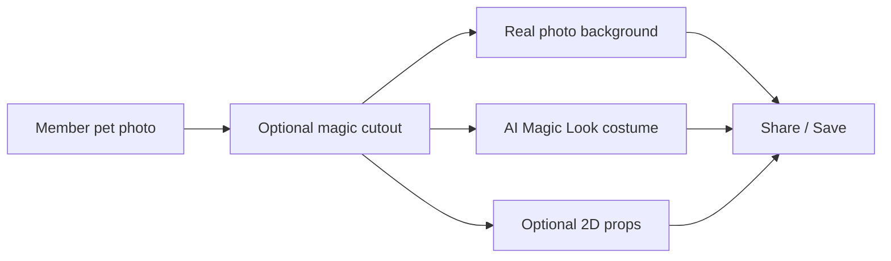

# SuperBud Photo Booth — Phase 4: Real Photo Backgrounds & Props

**Last updated:** June 14, 2026  
**Route:** `/photobooth`

---

## Short answer

**Yes — and most of it does not require new code.**

| Layer | Today | Phase 4 upgrade |
|-------|--------|-----------------|
| **Costumes on the pet** | **AI Magic Look** (Replicate) — already photoreal | Keep using this for Santa, witch, military, etc. |
| **Backgrounds** | Lake Legend = real photo; holidays = canvas gradients | Drop **JPG/PNG photos** into `public/images/photobooth/backgrounds/` |
| **Accessories (hats, capes, glasses)** | Cartoon **SVG** placeholders | Replace with **transparent PNG photo props** (same filenames or new `prop-*.png` files) |

The app already prefers a **PNG/JPG file** over a cartoon SVG when both exist. Add the real file → redeploy → members see the upgrade instantly.

---

## Three layers (how to think about it)



1. **AI Magic Look** — Best for *realistic costumes on the pet* (already live, uses app credits + Replicate).
2. **Photo backgrounds** — Best for *Christmas trees, spooky yards, boats, landmarks*.
3. **2D props** — Quick tap-to-add hats/bandanas; swap cartoon SVGs for cut-out PNG photos of real items.

**True AR** (costume tracks live on camera) is still a future native-app project — see Phase 3 roadmap.

---

## Background photos — what to create

### Image specs

| Spec | Value |
|------|--------|
| Size | **1200 × 900 px** (4:3) or **1600 × 1200** — app crops to fit |
| Format | **JPG** for photos (smaller files), **PNG** only if you need transparency |
| Subject | Leave **lower center** relatively open — that is where the pet sits |
| License | Own photos, Canva Pro, Adobe Stock, Unsplash+ — **must allow commercial use** |

### Drop-in filenames (wired in code)

Save files exactly as below under:

`public/images/photobooth/backgrounds/`

**Holidays** (replace gradient until file exists — gradient stays as fallback):

| Theme in app | Filename |
|--------------|----------|
| Christmas | `bg-holiday-christmas.jpg` — decorated house with lights *(primary)* |
| Christmas alt | `bg-holiday-christmas-trees.jpg` — tree farm / living room tree |
| Halloween | `bg-holiday-halloween.jpg` — front yard with spooky decorations |
| Thanksgiving | `bg-holiday-thanksgiving.jpg` — autumn porch / table |
| 4th of July | `bg-holiday-july-4th.jpg` — fireworks / flag display |
| New Year's | `bg-holiday-new-years.jpg` — party lights / city night |
| Easter | `bg-holiday-easter.jpg` — spring garden / eggs |
| St. Patrick's | `bg-holiday-st-patricks.jpg` — green décor / parade |
| Cinco de Mayo | `bg-holiday-cinco-de-mayo.jpg` — festive outdoor scene |
| Veterans Day | `bg-holiday-veterans.jpg` — memorial / honor garden |

**Adventures & landmarks** (new themes in style picker):

| Theme in app | Filename | Scene idea |
|--------------|----------|------------|
| Ocean Adventure | `bg-ocean-boat.jpg` | Dog-friendly boat deck, open ocean |
| Statue of Liberty | `bg-landmark-liberty.jpg` | Harbor view, statue visible |
| Golden Gate | `bg-landmark-golden-gate.jpg` | Bridge + bay |
| Grand Canyon | `bg-landmark-grand-canyon.jpg` | South rim overlook |
| Mount Rushmore | `bg-landmark-rushmore.jpg` | Monument + sky |
| Nashville / Music City | `bg-landmark-nashville.jpg` | Optional — local hero shot |
| White House lawn | `bg-landmark-white-house.jpg` | Patriotic scenic *(check usage rules)* |
| National Mall | `bg-landmark-national-mall.jpg` | Washington Monument / capitol view |

**Upgrade existing “basic” scenic PNGs** (optional — replace gradient-style art):

| Theme | Filename |
|-------|----------|
| Snowy Mountain | `bg-snow-mountain.jpg` |
| Tropical Beach | `bg-tropical-beach.jpg` |
| Patriot Pup | `bg-patriot-pup.jpg` |
| Hollywood Star | `bg-hollywood-star.jpg` |
| Birthday Bash | `bg-birthday-bash.jpg` |

---

## Where to get photos (founder-friendly)

1. **Your own photos** — Lake Legend already uses a real TN lake shot; same approach for holidays.
2. **Canva** — Search “Christmas house exterior lights background”, export JPG at 1200×900.
3. **Adobe Firefly / Midjourney / ChatGPT** — Generate once, **save as static files** in the repo (cheaper than generating per member).
4. **Stock sites** — Adobe Stock, Shutterstock, iStock (paid, clear license).
5. **Unsplash / Pexels** — Free with attribution rules; verify commercial use.

**Do not** call Replicate per member for backgrounds — one-time asset creation, then free forever for every share.

---

## Image sourcing checklist

Use this before every background or prop goes into the app. **When in doubt, skip the image** — one bad asset is not worth a copyright headache.

*This is practical guidance, not legal advice. For high-stakes use, a short consult with an IP attorney is cheap insurance.*

### Safe sources (best → acceptable)

| Rank | Source | OK for Photo Booth? | Notes |
|------|--------|---------------------|-------|
| 1 | **Your own photos** (camera roll, you took the shot) | ✅ Yes | Best option — no license to chase |
| 2 | **Canva Pro** — export from their photo/element library | ✅ Yes | Preferred stock path for Freedom Paws |
| 3 | **Paid stock** (Adobe Stock, Shutterstock, iStock) | ✅ Yes | Save receipt + license confirmation |
| 4 | **Unsplash / Pexels** | ✅ Usually | Read each photo’s license; note if attribution required |
| 5 | **One-time AI image** (Firefly, Midjourney, etc.) | ✅ Usually | Check that tool’s commercial-use terms; save the prompt + date |
| 6 | **Canva Free** | ⚠️ Case by case | Some assets restrict commercial/digital use — **Pro is safer** |
| 7 | **Facebook / Instagram / Google Images** (someone else’s post) | ❌ No | Public ≠ free to use; cropping does **not** fix this |
| 8 | **Facebook / Instagram** — **your own** upload | ✅ Yes | You own what you photographed |
| 9 | **Facebook / Instagram** — with **written permission** | ✅ Yes | Save screenshot or email/DM from the owner |

### Canva — rules that keep you safe

- [ ] Using **Canva Pro** (recommended for anything in the live app)
- [ ] Image comes from **Canva’s library** (Photos, Backgrounds, Elements) — not uploaded from the web
- [ ] Did **not** drop a Facebook/Google photo into Canva and export it (Canva doesn’t grant rights to stolen source material)
- [ ] Exported as **JPG** (backgrounds) or **PNG** (props) at **1200×900** or larger
- [ ] Asset is **not** marked “Editorial use only” (those are for news, not apps)
- [ ] Skimmed Canva’s [Content License Agreement](https://www.canva.com/policy/content-license-agreement/) once — especially **commercial use**

**Bottom line:** Build backgrounds in Canva Pro from their licensed library → export → drop into the repo. That’s the standard small-business path.

### Facebook & social media — do not clip and crop

| Myth | Reality |
|------|---------|
| “It’s public” | The poster/photographer still owns the copyright |
| “I cropped it” | Editing does **not** give you permission |
| “It’s just a background” | Commercial app use still needs a proper license |

**Only use social images if:** you took the photo, or you have **clear written OK** from the owner (save it).

### Before you add any file to the repo

- [ ] I know **who owns** this image (me, Canva Pro, stock site, etc.)
- [ ] License allows **commercial use** in a **website/app** (not personal-only)
- [ ] I am **not** reselling the raw image by itself — it’s part of Freedom Paws Photo Booth
- [ ] Lower center of background is **relatively open** for the pet
- [ ] Filename matches the Phase 4 table exactly (e.g. `bg-holiday-christmas.jpg`)
- [ ] Logged in the asset tracker below (copy one row per file)

### Simple asset log (copy into Notes or a spreadsheet)

| Filename | Theme / prop | Source | Date added | Notes |
|----------|--------------|--------|------------|-------|
| `bg-holiday-christmas.jpg` | Christmas | Canva Pro — “Christmas house lights exterior” | 2026-06-01 | Exported 1200×900 |
| `prop-santa-hat.png` | Santa hat | Canva Pro — removed background | 2026-06-01 | PNG transparent |

### Quick “can I use this?” decision

```
Did I take the photo myself?
  YES → ✅ Use it
  NO  → Did I get written permission from the owner?
          YES → ✅ Use it (save the message)
          NO  → Did I create/export it from Canva Pro or licensed stock?
                  YES → ✅ Use it (log the source)
                  NO  → ❌ Do not use — find a Canva Pro or own-photo alternative
```

### What to avoid entirely

- Random Facebook, Pinterest, or Google Image saves (even cropped or filtered)
- “Free wallpaper” sites with unclear licenses
- Screenshots of TV, movies, or branded characters (Disney, NFL, etc.) unless you have explicit rights
- Landmarks with **trademark restrictions** in commercial context — when unsure, use a generic scenic (e.g. “harbor at sunset”) instead of a tightly framed branded monument shot

---

## Real accessories (replace cartoon stickers)

### How the code works today

- Accessories live in `lib/photobooth/themes.ts` → `ACCESSORY_STICKERS`.
- Each item looks for **`sticker-name.png` first**, then falls back to **`sticker-name.svg`** (cartoon).
- **To upgrade an item:** add a transparent PNG with the **same name** under `public/images/photobooth/stickers/`.

Example: add `sticker-hat-party.png` (photo of a real party hat, background removed) → cartoon SVG is ignored.

### PNG prop specs

| Spec | Value |
|------|--------|
| Size | **512–1024 px** on longest side |
| Format | **PNG with transparent background** |
| Style | Single object, slight shadow OK, no pet in frame |
| Placement | App lets member drag, resize, rotate |

### Recommended real prop set (Phase 4A)

| File | Label | Notes |
|------|-------|-------|
| `prop-santa-hat.png` | Santa hat | Holiday |
| `prop-cowboy-hat.png` | Cowboy hat | Western / lake |
| `prop-bandana-usa.png` | USA bandana | Patriot |
| `prop-bandana-red.png` | Red bandana | Everyday |
| `prop-sunglasses.png` | Sunglasses | Summer / cool |
| `prop-bowtie.png` | Bow tie | Formal fun |
| `prop-scarf-plaid.png` | Plaid scarf | Fall / Christmas |
| `prop-flower-lei.png` | Flower lei | Beach |
| `prop-pilot-goggles.png` | Aviator goggles | Adventure |
| `prop-cape-red.png` | Red hero cape | SuperBud |

New `prop-*` files appear in the **“Photo props”** section of the accessory drawer once added.

### Cartoon stickers

Existing SVG items stay under **“Fun stickers”** until replaced or hidden. Members who want **fully realistic pets** should use **AI Magic Look** first; props are for quick extras.

---

## Founder workflow (no developer needed for assets)

1. Create or buy images using specs above.
2. Name files exactly as in the tables.
3. Copy into:
   - `public/images/photobooth/backgrounds/`
   - `public/images/photobooth/stickers/`
4. Commit + push (or send files to dev).
5. Redeploy — bump PWA version if members need a cache refresh.
6. Test on phone: Photo Booth → pick theme → pet should sit on real scene.

---

## Optional Phase 4B (later)

| Idea | Effort | Cost |
|------|--------|------|
| Hide cartoon section when all `prop-*` PNGs exist | Small code change | Free |
| Multiple backgrounds per holiday (sub-picker) | Medium | Free |
| AI background batch job (generate 20 scenes once) | One-time script | ~$2–5 total |
| Per-member AI background | Not recommended | Adds Replicate cost every share |

---

## Files touched in Phase 4 wiring

- `lib/photobooth/themes.ts` — background paths + landmark themes + prop list
- `app/photobooth/AccessoryDrawer.tsx` — “Photo props” vs “Fun stickers” sections
- `public/images/photobooth/backgrounds/` — your JPGs
- `public/images/photobooth/stickers/` — transparent PNG props

---

*Freedom Paws Wellness — Honor Buddy's Legacy*
